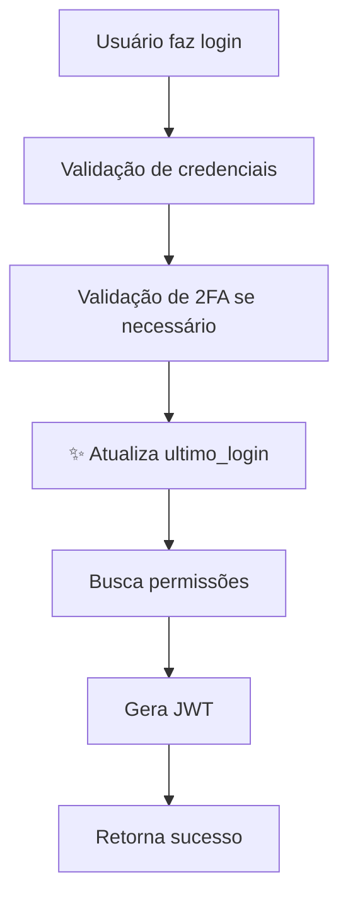

# Correção do Campo `ultimo_login`

## 🔍 Problema Identificado

O campo `ultimo_login` na tabela `users` não estava sendo atualizado após o login do usuário.

## ✅ Correções Realizadas

### 1. **Atualização do Código de Login**
   - **Arquivo**: `src/app/api/admin/auth/login/route.ts`
   - **Alteração**: Adicionada chamada para `updateLastLogin(user.id)` após login bem-sucedido
   - **Localização**: Linha 174 (após validação de 2FA)

### 2. **Função Criada**
   ```typescript
   async function updateLastLogin(userId: number): Promise<void> {
     try {
       const query = `
         UPDATE users 
         SET ultimo_login = NOW() 
         WHERE id = $1
       `;
       
       await pool.query(query, [userId]);
       console.log(`✅ Último login atualizado para usuário ID: ${userId}`);
     } catch (error) {
       console.error('❌ Erro ao atualizar último login:', error);
     }
   }
   ```

### 3. **Verificação do Banco de Dados**
   - **Arquivo**: `add-ultimo-login-field.sql`
   - **Propósito**: Verificar se o campo `ultimo_login` existe na tabela `users` e criá-lo se necessário

## 📋 Passos para Validar

### Passo 1: Verificar/Criar o Campo
Execute no **pgAdmin4**:
```sql
-- Abra o arquivo: add-ultimo-login-field.sql
-- Execute todo o conteúdo
```

Isso irá:
1. Verificar se o campo existe
2. Criar o campo se não existir
3. Mostrar a estrutura da tabela
4. Mostrar os dados atuais

### Passo 2: Testar o Login
1. Reinicie o servidor (`npm run dev`)
2. Faça login no sistema (`http://localhost:3000/login`)
3. Após login bem-sucedido, verifique o console do servidor
   - Deve aparecer: `✅ Último login atualizado para usuário ID: X`

### Passo 3: Verificar no Banco de Dados
Execute no **pgAdmin4**:
```sql
SELECT 
    id, 
    username, 
    email,
    ultimo_login,
    created_at
FROM users 
ORDER BY ultimo_login DESC NULLS LAST;
```

## 🔄 Como Funciona Agora



## 📊 Resultado Esperado

Após o login, a tabela `users` deve mostrar:

| id | username | email | ultimo_login | created_at |
|----|----------|-------|--------------|------------|
| 1  | admin    | admin@email.com | 2025-10-11 14:30:25 | 2025-01-10 10:00:00 |
| 2  | MariaSilva | maria@email.com | 2025-10-11 13:45:10 | 2025-01-15 15:30:00 |

## 🎯 Benefícios

1. **Auditoria**: Rastreamento de quando cada usuário acessou o sistema pela última vez
2. **Segurança**: Identificação de contas inativas
3. **Compliance**: Registro de atividade de usuários
4. **Gestão**: Informação útil para administradores monitorarem uso do sistema

## 📝 Notas Técnicas

- O campo `ultimo_login` é do tipo `TIMESTAMP`
- Aceita valores `NULL` (usuários que nunca fizeram login)
- É atualizado automaticamente a cada login bem-sucedido
- Usa `NOW()` do PostgreSQL para garantir precisão do horário do servidor
- A atualização ocorre **após** a validação de 2FA (se habilitado)
- Não bloqueia o login em caso de erro na atualização (tratamento de erro silencioso)


