# 📊 DIAGRAMAS VISUAIS DO SISTEMA DE SEGURANÇA

**Versão:** 1.0  
**Data:** 2025-10-08

---

## 📑 ÍNDICE

1. [Diagrama Entidade-Relacionamento (ER)](#diagrama-er)
2. [Diagrama de Fluxo de Autenticação](#fluxo-autenticação)
3. [Diagrama de Fluxo de Autorização](#fluxo-autorização)
4. [Diagrama de Estados](#diagrama-estados)
5. [Diagrama de Componentes](#diagrama-componentes)
6. [Diagrama de Sequência](#diagrama-sequência)

---

## 🔄 DIAGRAMA ER (Entidade-Relacionamento)

### Modelo Completo

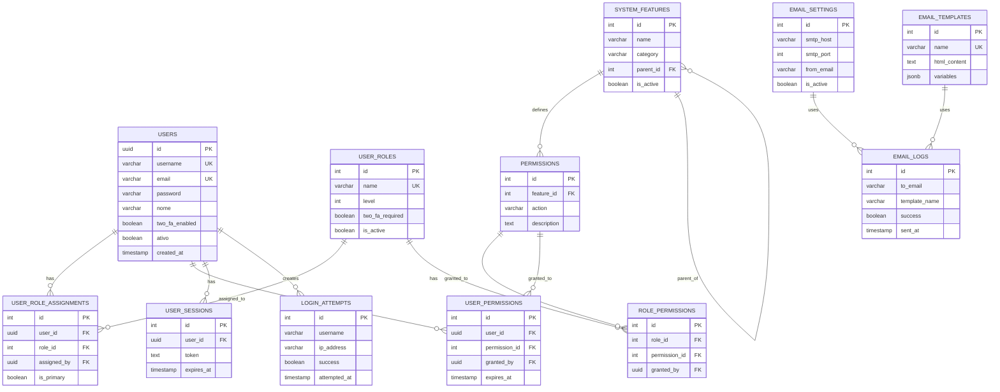

---

## 🔐 FLUXO DE AUTENTICAÇÃO

### Login com 2FA

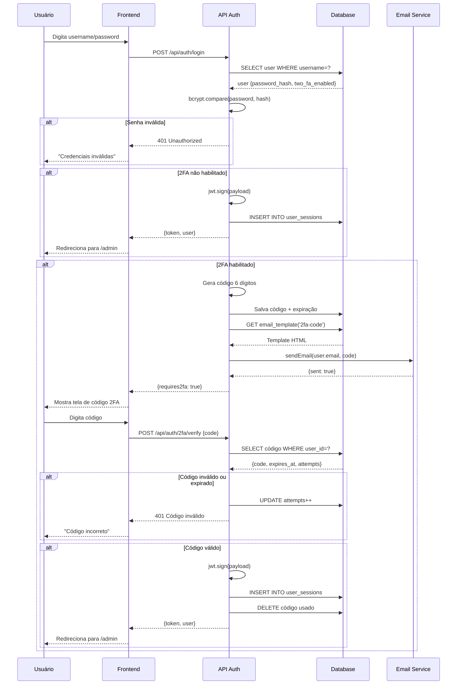

### Logout

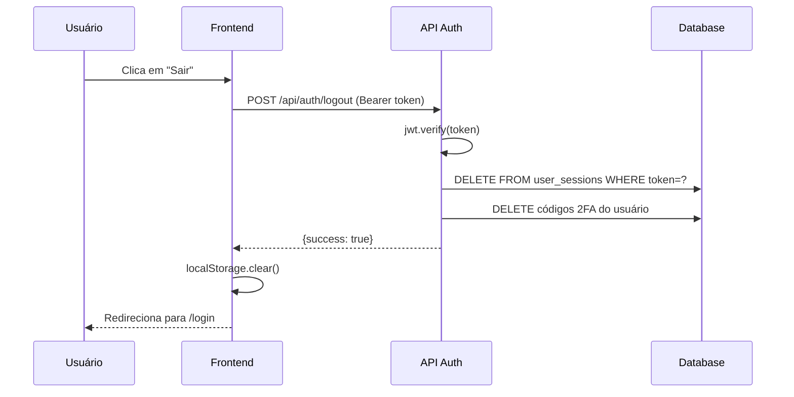

---

## ⚖️ FLUXO DE AUTORIZAÇÃO

### Verificação de Permissão

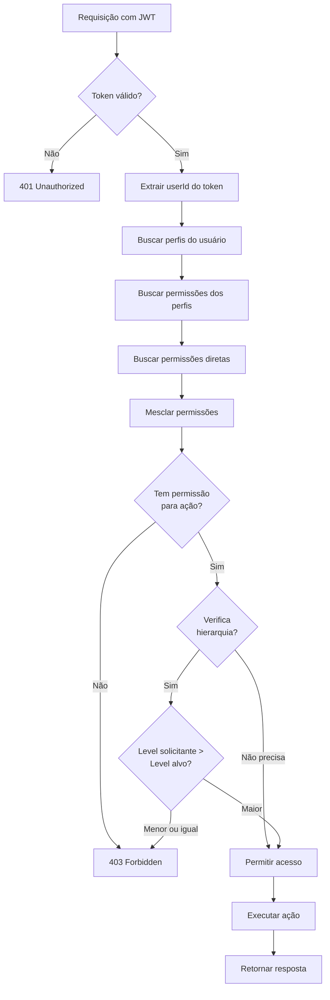

### Hierarquia de Perfis

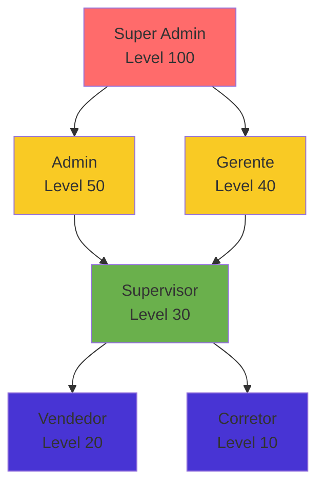

---

## 🔄 DIAGRAMA DE ESTADOS

### Estados do Usuário

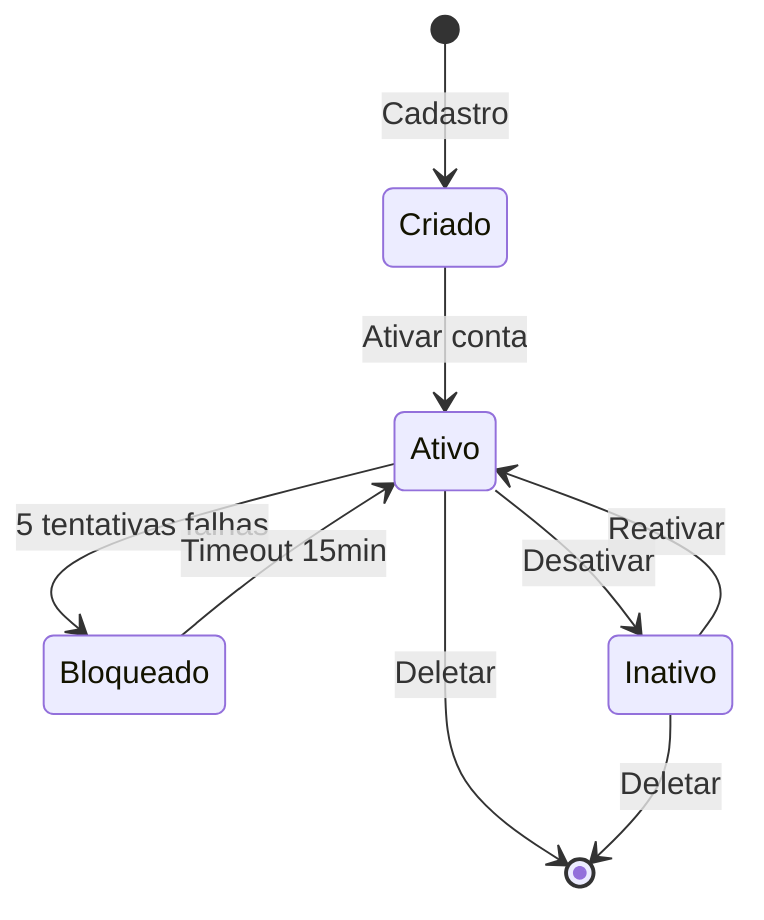

### Estados da Sessão

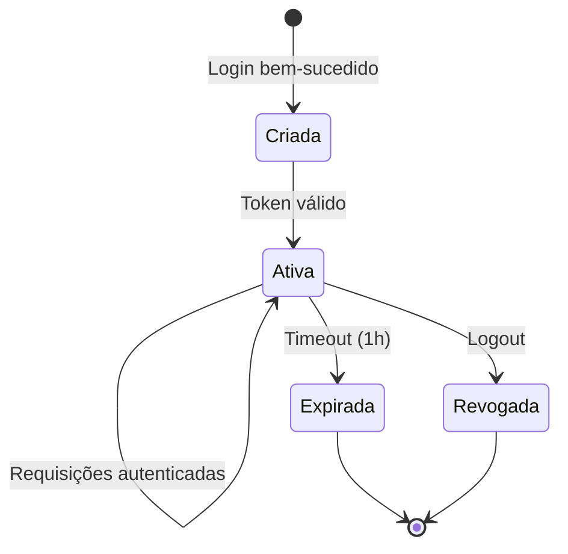

### Estados do Código 2FA

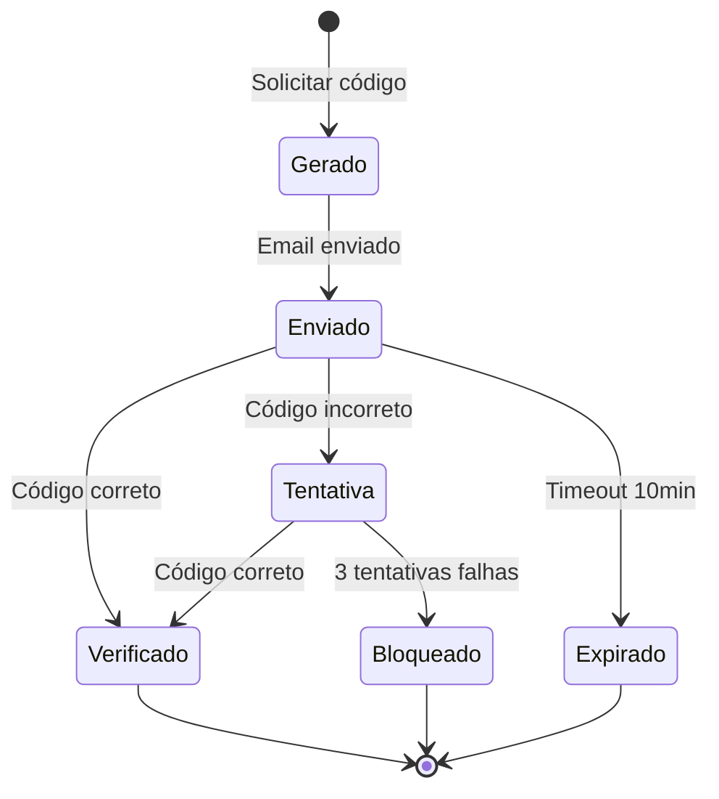

---

## 🏗️ DIAGRAMA DE COMPONENTES

### Arquitetura do Sistema

```mermaid
graph TB
    subgraph "Frontend - Next.js"
        F1[Pages<br/>/login, /admin]
        F2[Components<br/>Auth, RBAC]
        F3[Hooks<br/>useAuth, usePermission]
        F1 --> F2
        F2 --> F3
    end
    
    subgraph "Backend - API Routes"
        B1[/api/auth/*<br/>Login, Logout, 2FA]
        B2[/api/admin/*<br/>CRUD Admin]
        B3[/api/public/*<br/>Public APIs]
    end
    
    subgraph "Services"
        S1[emailService.ts<br/>Nodemailer]
        S2[twoFactorAuthService.ts<br/>2FA Logic]
        S3[authService.ts<br/>JWT, bcrypt]
    end
    
    subgraph "Middleware"
        M1[authMiddleware<br/>Verifica JWT]
        M2[permissionMiddleware<br/>Checa RBAC]
        M3[rateLimitMiddleware<br/>Limita requests]
    end
    
    subgraph "Database - PostgreSQL"
        D1[(users<br/>user_roles<br/>permissions)]
        D2[(email_settings<br/>email_templates<br/>email_logs)]
        D3[(user_sessions<br/>login_attempts<br/>2fa_codes)]
    end
    
    F1 --> B1
    F1 --> B2
    F1 --> B3
    
    B1 --> M1
    B2 --> M1
    B1 --> M3
    B2 --> M3
    
    M1 --> M2
    M2 --> S3
    
    B1 --> S2
    S2 --> S1
    
    S1 --> D2
    S2 --> D3
    S3 --> D1
    M2 --> D1
```

---

## 📋 DIAGRAMA DE SEQUÊNCIA - CASOS DE USO

### Criar Novo Usuário

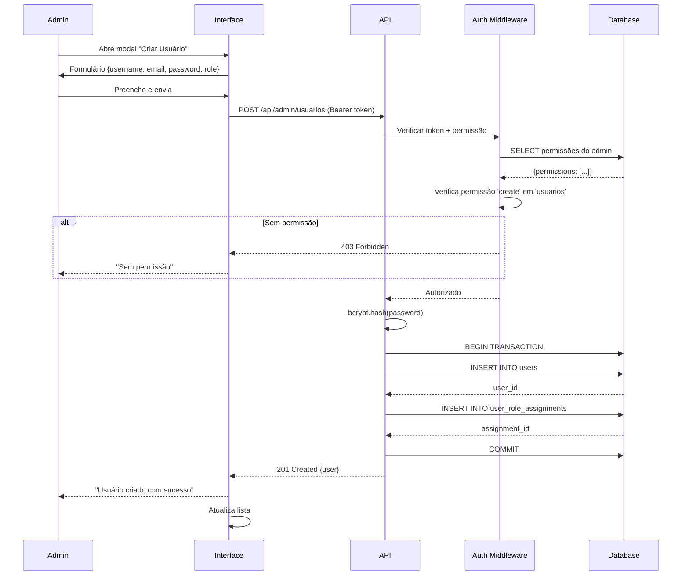

### Editar Permissões de Perfil

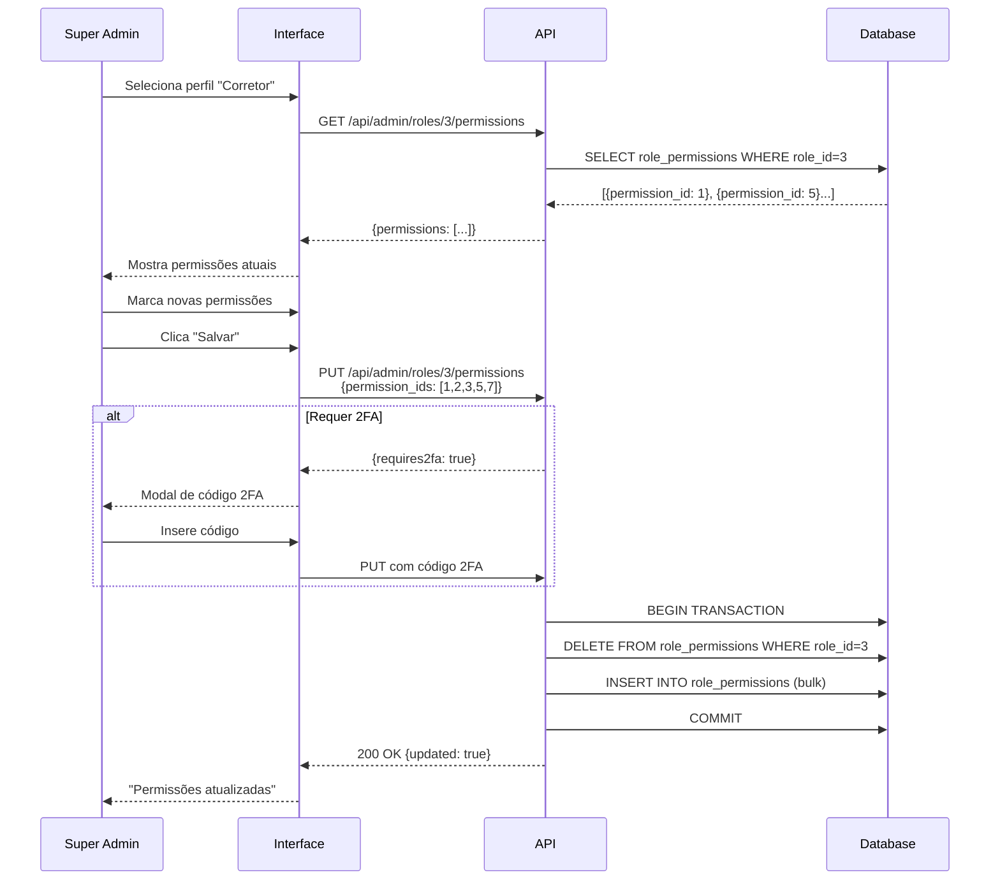

---

## 📊 DIAGRAMA DE FLUXO DE DADOS

### Fluxo Completo de Autenticação

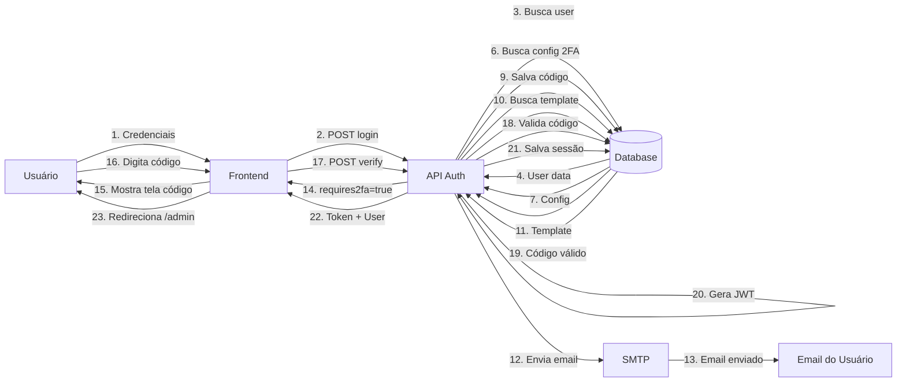

### Fluxo de Autorização

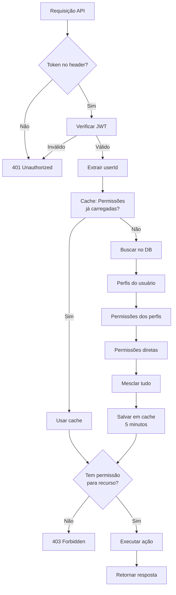

---

## 🔄 CICLO DE VIDA DE DADOS

### Sessão de Usuário

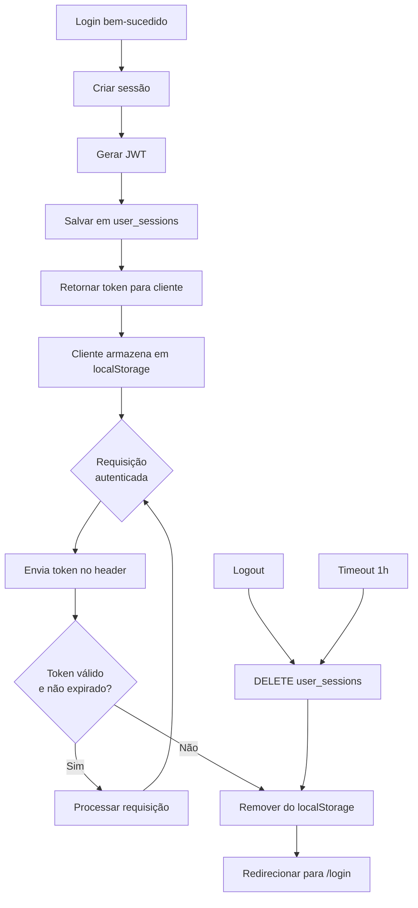

### Código 2FA

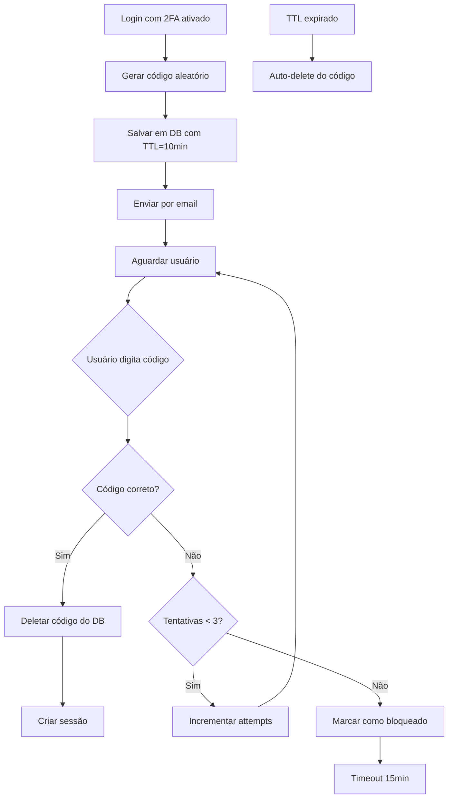

---

## 📈 MÉTRICAS E MONITORAMENTO

### Pontos de Medição

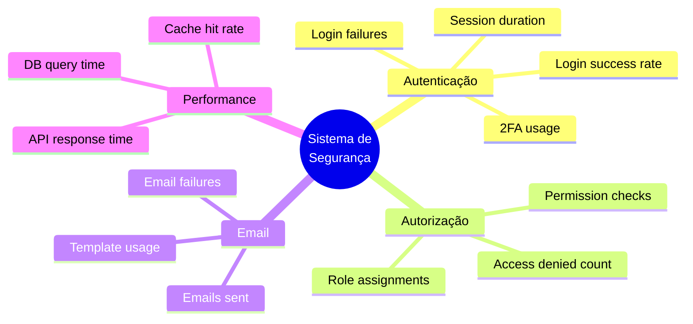

---

**Documento gerado em:** 2025-10-08  
**Ferramenta:** Mermaid.js  
**Visualização:** GitHub, VS Code, Markdown viewers
