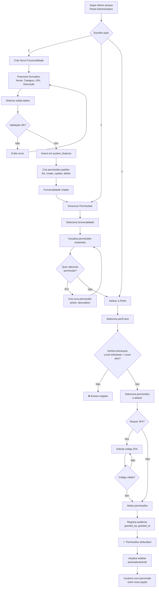

# 📘 GUIA COMPLETO: ADICIONAR NOVA FUNCIONALIDADE AO SISTEMA

**Sistema Net Imobiliária**  
**Versão:** 1.0  
**Data:** 2025-10-09

---

## 📑 ÍNDICE

1. [Visão Geral](#visão-geral)
2. [Quem Pode Adicionar Funcionalidades](#quem-pode-adicionar)
3. [Fluxo Completo](#fluxo-completo)
4. [Interface de Gerenciamento](#interface-de-gerenciamento)
5. [Fluxo de Autorização](#fluxo-de-autorização)
6. [Exemplo Prático](#exemplo-prático)
7. [Checklist](#checklist)

---

## 🎯 VISÃO GERAL

### O que é uma "Funcionalidade"?

Uma funcionalidade (feature) é um **recurso do sistema** que pode ter permissões associadas e aparecer na sidebar do painel administrativo.

**Exemplos:**
- Gestão de Imóveis
- Gestão de Clientes
- Relatórios
- Dashboards

### Componentes de uma Funcionalidade

```
┌─────────────────────────────────────────────────────────┐
│                   FUNCIONALIDADE                        │
├─────────────────────────────────────────────────────────┤
│                                                         │
│  1. REGISTRO NO BANCO (system_features)                │
│     • ID                                                │
│     • Nome (ex: "Gestão de Contratos")                 │
│     • Category (ex: "contratos")                       │
│     • URL (ex: "/admin/contratos")                     │
│     • Descrição                                         │
│                                                         │
│  2. PERMISSÕES (permissions)                           │
│     • list   - Visualizar/Listar                       │
│     • create - Criar novos                             │
│     • update - Editar existentes                       │
│     • delete - Excluir                                 │
│     • export - Exportar dados (opcional)               │
│     • admin  - Acesso administrativo (opcional)        │
│                                                         │
│  3. ATRIBUIÇÃO A PERFIS (role_permissions)             │
│     • Quais perfis têm acesso?                         │
│     • Quais permissões cada perfil tem?                │
│                                                         │
│  4. INTERFACE (AdminSidebar.tsx)                       │
│     • Item de menu na sidebar                          │
│     • Ícone                                            │
│     • Sub-opções (se houver)                           │
│                                                         │
│  5. PÁGINA/COMPONENTE (Next.js)                        │
│     • /app/admin/[funcionalidade]/page.tsx             │
│     • Componentes React                                │
│     • APIs necessárias                                 │
│                                                         │
└─────────────────────────────────────────────────────────┘
```

---

## 👥 QUEM PODE ADICIONAR FUNCIONALIDADES

### Hierarquia de Permissões

```
┌─────────────────────────────────────────────────────────┐
│                    SUPER ADMIN                          │
│                    (Level 100)                          │
│  ✅ Pode TUDO                                           │
│  • Criar funcionalidades                               │
│  • Criar permissões                                    │
│  • Atribuir a qualquer perfil                          │
│  • Modificar hierarquia                                │
└─────────────────────────────────────────────────────────┘
                          │
                          ▼
┌─────────────────────────────────────────────────────────┐
│                       ADMIN                             │
│                    (Level 50)                           │
│  ⚠️ Pode ALGUMAS coisas                                 │
│  • Criar funcionalidades (se tiver permissão)          │
│  • Atribuir a perfis de nível MENOR                    │
│  • NÃO pode modificar Super Admin                      │
└─────────────────────────────────────────────────────────┘
                          │
                          ▼
┌─────────────────────────────────────────────────────────┐
│                  OUTROS PERFIS                          │
│              (Level < 50)                               │
│  ❌ NÃO PODEM                                           │
│  • Apenas usam as funcionalidades                      │
│  • Não gerenciam permissões                            │
└─────────────────────────────────────────────────────────┘
```

### Permissões Necessárias

Para adicionar uma nova funcionalidade, o usuário precisa ter:

1. ✅ **Permissão em `system_features`:**
   - `create` - Para criar a funcionalidade

2. ✅ **Permissão em `permissions`:**
   - `create` - Para criar as permissões

3. ✅ **Permissão em `role_permissions`:**
   - `create` - Para atribuir permissões aos perfis

4. ✅ **Nível hierárquico adequado:**
   - Level >= 50 (Admin ou superior)

---

## 🔄 FLUXO COMPLETO

### Diagrama de Fluxo



---

## 🖥️ INTERFACE DE GERENCIAMENTO

### 1. Página: Gerenciar Funcionalidades

**Localização:** `/admin/system-features` (a ser criada)

**Layout:**

```
┌─────────────────────────────────────────────────────────┐
│  🏠 Painel Administrativo > Funcionalidades do Sistema  │
├─────────────────────────────────────────────────────────┤
│                                                         │
│  [+ Nova Funcionalidade]              [🔍 Buscar...]   │
│                                                         │
│  ┌───────────────────────────────────────────────────┐ │
│  │ Funcionalidades Cadastradas (21)                  │ │
│  ├───────────────────────────────────────────────────┤ │
│  │                                                    │ │
│  │ ✅ Gestão de Imóveis                              │ │
│  │    Category: imoveis | URL: /admin/imoveis        │ │
│  │    Permissões: 4 | Perfis com acesso: 3          │ │
│  │    [✏️ Editar] [🔑 Permissões] [🗑️ Excluir]        │ │
│  │                                                    │ │
│  │ ✅ Gestão de Clientes                             │ │
│  │    Category: clientes | URL: /admin/clientes      │ │
│  │    Permissões: 4 | Perfis com acesso: 2          │ │
│  │    [✏️ Editar] [🔑 Permissões] [🗑️ Excluir]        │ │
│  │                                                    │ │
│  │ ...                                                │ │
│  │                                                    │ │
│  └───────────────────────────────────────────────────┘ │
│                                                         │
└─────────────────────────────────────────────────────────┘
```

### 2. Modal: Nova Funcionalidade

```
┌─────────────────────────────────────────────────────────┐
│  ➕ Criar Nova Funcionalidade                     [✕]   │
├─────────────────────────────────────────────────────────┤
│                                                         │
│  Nome da Funcionalidade *                              │
│  ┌───────────────────────────────────────────────────┐ │
│  │ Gestão de Contratos                               │ │
│  └───────────────────────────────────────────────────┘ │
│                                                         │
│  Category (identificador único) *                      │
│  ┌───────────────────────────────────────────────────┐ │
│  │ contratos                                         │ │
│  └───────────────────────────────────────────────────┘ │
│  ℹ️ Apenas letras minúsculas, números e hífen         │
│                                                         │
│  URL da Página *                                       │
│  ┌───────────────────────────────────────────────────┐ │
│  │ /admin/contratos                                  │ │
│  └───────────────────────────────────────────────────┘ │
│                                                         │
│  Descrição                                             │
│  ┌───────────────────────────────────────────────────┐ │
│  │ Gestão completa de contratos de locação e venda  │ │
│  │                                                    │ │
│  └───────────────────────────────────────────────────┘ │
│                                                         │
│  ☑️ Ativa                                              │
│  ☑️ Criar permissões padrão (list, create, update,    │
│     delete)                                            │
│  ☐ Atribuir automaticamente ao Super Admin            │
│                                                         │
│  [Cancelar]                           [✅ Criar]       │
│                                                         │
└─────────────────────────────────────────────────────────┘
```

### 3. Modal: Gerenciar Permissões da Funcionalidade

```
┌─────────────────────────────────────────────────────────┐
│  🔑 Permissões: Gestão de Contratos               [✕]   │
├─────────────────────────────────────────────────────────┤
│                                                         │
│  [+ Nova Permissão]                                    │
│                                                         │
│  Permissões Existentes:                                │
│                                                         │
│  ┌───────────────────────────────────────────────────┐ │
│  │ ✅ list - Listar contratos                        │ │
│  │    Perfis com acesso: Super Admin, Admin         │ │
│  │    [✏️ Editar] [🗑️ Excluir]                        │ │
│  ├───────────────────────────────────────────────────┤ │
│  │ ✅ create - Criar contratos                       │ │
│  │    Perfis com acesso: Super Admin, Admin         │ │
│  │    [✏️ Editar] [🗑️ Excluir]                        │ │
│  ├───────────────────────────────────────────────────┤ │
│  │ ✅ update - Editar contratos                      │ │
│  │    Perfis com acesso: Super Admin, Admin         │ │
│  │    [✏️ Editar] [🗑️ Excluir]                        │ │
│  ├───────────────────────────────────────────────────┤ │
│  │ ✅ delete - Excluir contratos                     │ │
│  │    Perfis com acesso: Super Admin                │ │
│  │    [✏️ Editar] [🗑️ Excluir]                        │ │
│  ├───────────────────────────────────────────────────┤ │
│  │ ✅ approve - Aprovar contratos                    │ │
│  │    Perfis com acesso: Super Admin, Admin         │ │
│  │    [✏️ Editar] [🗑️ Excluir]                        │ │
│  └───────────────────────────────────────────────────┘ │
│                                                         │
│  [Fechar]                                              │
│                                                         │
└─────────────────────────────────────────────────────────┘
```

### 4. Página: Atribuir Permissões a Perfis

**Localização:** `/admin/roles/[id]/permissions` (já existe)

**Fluxo:**
1. Admin acessa "Gestão de Perfis"
2. Seleciona um perfil (ex: "Corretor")
3. Clica em "Configurar Permissões"
4. Vê matriz de permissões com a nova funcionalidade
5. Marca/desmarca as permissões desejadas
6. Se for operação crítica, sistema pede código 2FA
7. Salva as alterações

---

## ⚖️ FLUXO DE AUTORIZAÇÃO

### 1. Criação da Funcionalidade

```
┌─────────────────────────────────────────────────────────┐
│  REQUISIÇÃO: POST /api/admin/system-features           │
├─────────────────────────────────────────────────────────┤
│                                                         │
│  1. Middleware de Autenticação                         │
│     ├─ Verifica JWT                                    │
│     ├─ Extrai userId                                   │
│     └─ ✅ Token válido                                  │
│                                                         │
│  2. Middleware de Permissão                            │
│     ├─ Busca permissões do usuário                     │
│     ├─ Verifica: tem 'create' em 'system_features'?   │
│     └─ ✅ Tem permissão                                 │
│                                                         │
│  3. Validação de Dados                                 │
│     ├─ Nome: obrigatório, único                        │
│     ├─ Category: obrigatório, único, formato válido    │
│     ├─ URL: obrigatório, formato válido                │
│     └─ ✅ Dados válidos                                 │
│                                                         │
│  4. Inserção no Banco                                  │
│     ├─ BEGIN TRANSACTION                               │
│     ├─ INSERT INTO system_features                     │
│     ├─ INSERT INTO permissions (4x)                    │
│     ├─ COMMIT                                          │
│     └─ ✅ Funcionalidade criada                         │
│                                                         │
│  5. Auditoria                                          │
│     ├─ Registra em audit_log                           │
│     ├─ created_by = userId                             │
│     └─ ✅ Auditado                                      │
│                                                         │
│  6. Resposta                                           │
│     └─ 201 Created { id, name, category }             │
│                                                         │
└─────────────────────────────────────────────────────────┘
```

### 2. Atribuição de Permissões a Perfis

```
┌─────────────────────────────────────────────────────────┐
│  REQUISIÇÃO: PUT /api/admin/roles/[roleId]/permissions│
├─────────────────────────────────────────────────────────┤
│                                                         │
│  1. Autenticação                                       │
│     └─ ✅ JWT válido                                    │
│                                                         │
│  2. Verificação de Hierarquia                          │
│     ├─ Level do solicitante: 50 (Admin)               │
│     ├─ Level do perfil alvo: 10 (Corretor)            │
│     ├─ 50 > 10?                                        │
│     └─ ✅ Pode modificar                                │
│                                                         │
│  3. Verificação 2FA (se necessário)                    │
│     ├─ Operação é crítica?                             │
│     ├─ Perfil requer 2FA?                              │
│     └─ Se SIM: solicita código                         │
│                                                         │
│  4. Atualização de Permissões                          │
│     ├─ BEGIN TRANSACTION                               │
│     ├─ DELETE role_permissions WHERE role_id=?         │
│     ├─ INSERT role_permissions (bulk)                  │
│     ├─ granted_by = userId                             │
│     ├─ granted_at = NOW()                              │
│     ├─ COMMIT                                          │
│     └─ ✅ Permissões atualizadas                        │
│                                                         │
│  5. Invalidação de Cache                               │
│     ├─ Invalida cache de permissões dos usuários      │
│     │  com esse perfil                                 │
│     └─ ✅ Cache limpo                                   │
│                                                         │
│  6. Notificação (opcional)                             │
│     ├─ Envia email para usuários afetados              │
│     └─ "Suas permissões foram atualizadas"            │
│                                                         │
└─────────────────────────────────────────────────────────┘
```

### 3. Acesso à Nova Funcionalidade

```
┌─────────────────────────────────────────────────────────┐
│  USUÁRIO ACESSA: /admin/contratos                      │
├─────────────────────────────────────────────────────────┤
│                                                         │
│  1. Renderização da Sidebar                            │
│     ├─ Busca perfis do usuário                         │
│     ├─ Busca permissões dos perfis                     │
│     ├─ Verifica: tem 'list' em 'contratos'?           │
│     └─ ✅ TEM → Exibe opção na sidebar                 │
│                                                         │
│  2. Clique na Opção                                    │
│     ├─ Navega para /admin/contratos                    │
│     └─ ✅ Página carrega                                │
│                                                         │
│  3. Requisição de Dados                                │
│     ├─ GET /api/admin/contratos                        │
│     ├─ Middleware verifica 'list' em 'contratos'      │
│     └─ ✅ Retorna dados                                 │
│                                                         │
│  4. Ações na Interface                                 │
│     ├─ Botão "Novo": verifica 'create'                │
│     ├─ Botão "Editar": verifica 'update'              │
│     ├─ Botão "Excluir": verifica 'delete'             │
│     └─ Mostra apenas ações permitidas                  │
│                                                         │
└─────────────────────────────────────────────────────────┘
```

---

## 💡 EXEMPLO PRÁTICO

### Cenário: Adicionar "Gestão de Contratos"

#### Passo 1: Super Admin cria a funcionalidade

```sql
-- Executado automaticamente pela interface
INSERT INTO system_features (name, category, description, url, is_active)
VALUES (
  'Gestão de Contratos',
  'contratos',
  'Gestão completa de contratos de locação e venda',
  '/admin/contratos',
  true
)
RETURNING id;
-- Retorna: id = 72
```

#### Passo 2: Sistema cria permissões padrão

```sql
-- Executado automaticamente
INSERT INTO permissions (feature_id, action, description)
VALUES
  (72, 'list', 'Listar contratos'),
  (72, 'create', 'Criar contratos'),
  (72, 'update', 'Editar contratos'),
  (72, 'delete', 'Excluir contratos');
```

#### Passo 3: Super Admin atribui ao perfil "Admin"

```sql
-- Via interface /admin/roles/2/permissions
INSERT INTO role_permissions (role_id, permission_id, granted_by)
SELECT 
  2, -- ID do perfil Admin
  p.id,
  'uuid-do-super-admin'
FROM permissions p
WHERE p.feature_id = 72
  AND p.action IN ('list', 'create', 'update');
-- Nota: 'delete' não foi incluído intencionalmente
```

#### Passo 4: Desenvolvedor adiciona à sidebar

```typescript
// src/components/admin/AdminSidebar.tsx
{
  name: 'Contratos',
  icon: DocumentTextIcon,
  resource: 'contratos',
  roles: ['Super Admin', 'Administrador'],
  children: [
    {
      name: 'Listar Contratos',
      href: '/admin/contratos',
      icon: ClipboardDocumentListIcon,
      resource: 'contratos',
      roles: ['Super Admin', 'Administrador']
    }
  ]
}
```

#### Passo 5: Desenvolvedor cria a página

```typescript
// src/app/admin/contratos/page.tsx
'use client'

import { useEffect, useState } from 'react'
import PermissionGuard from '@/components/admin/PermissionGuard'

export default function ContratosPage() {
  const [contratos, setContratos] = useState([])

  useEffect(() => {
    // Buscar contratos da API
    fetch('/api/admin/contratos')
      .then(res => res.json())
      .then(data => setContratos(data))
  }, [])

  return (
    <PermissionGuard resource="contratos" permission="READ">
      <div>
        <h1>Gestão de Contratos</h1>
        
        <PermissionGuard resource="contratos" permission="WRITE">
          <button>+ Novo Contrato</button>
        </PermissionGuard>

        {/* Lista de contratos */}
      </div>
    </PermissionGuard>
  )
}
```

#### Passo 6: Desenvolvedor cria a API

```typescript
// src/app/api/admin/contratos/route.ts
import { NextRequest, NextResponse } from 'next/server'
import { checkPermission } from '@/lib/middleware/permissionMiddleware'

export async function GET(request: NextRequest) {
  // Verifica permissão
  const hasPermission = await checkPermission(request, 'contratos', 'READ')
  
  if (!hasPermission) {
    return NextResponse.json(
      { error: 'Sem permissão' },
      { status: 403 }
    )
  }

  // Buscar contratos do banco
  const contratos = await buscarContratos()
  
  return NextResponse.json(contratos)
}
```

#### Resultado Final

**Para Super Admin:**
- ✅ Vê "Contratos" na sidebar
- ✅ Pode listar, criar, editar e excluir

**Para Admin:**
- ✅ Vê "Contratos" na sidebar
- ✅ Pode listar, criar e editar
- ❌ NÃO pode excluir

**Para Corretor:**
- ❌ NÃO vê "Contratos" na sidebar
- ❌ Sem acesso

---

## ✅ CHECKLIST

### Para Adicionar Nova Funcionalidade

#### 1. Planejamento
- [ ] Definir nome da funcionalidade
- [ ] Definir category (identificador único)
- [ ] Definir URL da página
- [ ] Listar permissões necessárias
- [ ] Definir quais perfis terão acesso

#### 2. Banco de Dados
- [ ] Inserir em `system_features`
- [ ] Criar permissões em `permissions`
- [ ] Atribuir a perfis em `role_permissions`
- [ ] Testar queries SQL

#### 3. Backend (APIs)
- [ ] Criar rota `/api/admin/[funcionalidade]/route.ts`
- [ ] Implementar GET (listar)
- [ ] Implementar POST (criar)
- [ ] Implementar PUT (editar)
- [ ] Implementar DELETE (excluir)
- [ ] Adicionar middleware de permissão
- [ ] Testar todas as rotas

#### 4. Frontend (Interface)
- [ ] Criar página `/app/admin/[funcionalidade]/page.tsx`
- [ ] Adicionar item na sidebar (`AdminSidebar.tsx`)
- [ ] Implementar listagem
- [ ] Implementar formulário de criação
- [ ] Implementar formulário de edição
- [ ] Adicionar `PermissionGuard` em ações
- [ ] Testar interface

#### 5. Testes
- [ ] Testar como Super Admin
- [ ] Testar como Admin
- [ ] Testar como Corretor (sem acesso)
- [ ] Testar criação de registros
- [ ] Testar edição de registros
- [ ] Testar exclusão de registros
- [ ] Verificar logs de auditoria

#### 6. Documentação
- [ ] Atualizar documentação técnica
- [ ] Atualizar guia do usuário
- [ ] Documentar APIs (Swagger/OpenAPI)
- [ ] Criar exemplos de uso

---

## 🔒 SEGURANÇA

### Validações Obrigatórias

1. **Na criação da funcionalidade:**
   - ✅ Nome único
   - ✅ Category único e formato válido
   - ✅ URL válida e única
   - ✅ Usuário tem permissão de criar

2. **Na atribuição de permissões:**
   - ✅ Verificar hierarquia de perfis
   - ✅ Solicitar 2FA se necessário
   - ✅ Registrar auditoria (granted_by)
   - ✅ Validar que permissões existem

3. **No acesso à funcionalidade:**
   - ✅ JWT válido
   - ✅ Usuário ativo
   - ✅ Permissão específica para ação
   - ✅ Rate limiting

### Auditoria

Todas as operações devem ser auditadas:

```sql
-- Exemplo de registro de auditoria
INSERT INTO audit_log (
  user_id,
  action,
  resource_type,
  resource_id,
  details,
  ip_address,
  created_at
)
VALUES (
  'uuid-do-usuario',
  'CREATE_FEATURE',
  'system_features',
  72,
  '{"name": "Gestão de Contratos", "category": "contratos"}',
  '192.168.1.100',
  NOW()
);
```

---

## 📞 SUPORTE

### Dúvidas Frequentes

**Q: Posso criar uma funcionalidade sem interface?**
A: Sim! Você pode criar apenas no banco para controle de permissões de APIs.

**Q: Como remover uma funcionalidade?**
A: Marque `is_active = false` em vez de deletar. Isso preserva o histórico.

**Q: Posso ter sub-funcionalidades?**
A: Sim! Use o campo `parent_id` em `system_features` para criar hierarquia.

**Q: Como testar sem afetar produção?**
A: Use o ambiente de desenvolvimento e crie perfis de teste.

---

**Documento criado em:** 2025-10-09  
**Versão:** 1.0  
**Última atualização:** 2025-10-09
