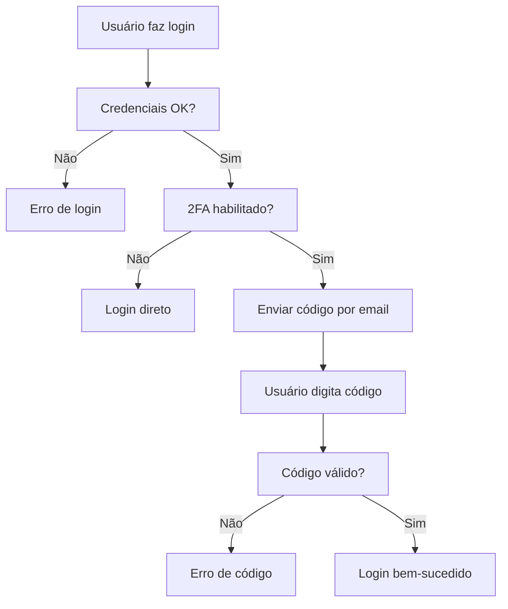

# 🚀 PLANO PARA COMPLETAR IMPLEMENTAÇÃO DO 2FA

## 📋 O QUE ESTÁ FALTANDO

Baseado na nossa análise anterior, o sistema 2FA está **PARCIALMENTE implementado**:

### ✅ O que JÁ EXISTE:
- **Tabelas 2FA**: `system_2fa_settings`, `email_settings` 
- **APIs 2FA**: `/api/admin/auth/2fa/*` (send-code, verify-code, enable, disable, status)
- **Serviços**: `twoFactorAuthService.ts`, `emailService.ts`
- **Configurações**: Email SMTP configurado

### ❌ O que está FALTANDO:
1. **Campos na tabela `users`**:
   - `two_fa_enabled` (BOOLEAN)
   - `two_fa_secret` (VARCHAR)
   
2. **Template de email**:
   - Template `2fa-code` na tabela `email_templates`

## 🛠️ ARQUIVOS CRIADOS PARA CORREÇÃO

### 1. **`verificar-status-2fa.sql`** 📊
- **Propósito**: Verificar o estado atual da implementação
- **O que faz**: Lista campos faltantes, templates, configurações
- **Como usar**: Execute no pgAdmin4 para diagnóstico

### 2. **`completar-implementacao-2fa.sql`** 🔧
- **Propósito**: Completar a implementação faltante
- **O que faz**:
  - Adiciona campos `two_fa_enabled`, `two_fa_secret`, `ultimo_login` na tabela `users`
  - Cria template `2fa-code` completo com HTML e texto
  - Verifica se tudo foi criado corretamente

### 3. **`test-2fa-complete.js`** 🧪
- **Propósito**: Testar se a implementação está funcionando
- **O que faz**: Verifica todos os componentes do 2FA
- **Como usar**: `node test-2fa-complete.js`

## 📝 PASSO A PASSO PARA COMPLETAR

### **PASSO 1: Diagnóstico** 🔍
Execute no **pgAdmin4**:
```sql
-- Abra o arquivo: verificar-status-2fa.sql
-- Execute todo o conteúdo
```

**Resultado esperado**: Verá o que está faltando (campos, template)

### **PASSO 2: Implementação** 🔧
Execute no **pgAdmin4**:
```sql
-- Abra o arquivo: completar-implementacao-2fa.sql  
-- Execute todo o conteúdo
```

**Resultado esperado**: 
- ✅ Campos adicionados na tabela `users`
- ✅ Template `2fa-code` criado
- ✅ Mensagem "IMPLEMENTAÇÃO 2FA COMPLETA!"

### **PASSO 3: Validação** ✅
Execute no terminal:
```bash
node test-2fa-complete.js
```

**Resultado esperado**: 
- ✅ Todos os campos existem
- ✅ Template criado
- ✅ Configurações OK
- 🎉 "2FA IMPLEMENTADO COMPLETAMENTE!"

## 🎯 APÓS COMPLETAR A IMPLEMENTAÇÃO

### **Funcionalidades que funcionarão**:
1. **Ativar 2FA** para usuários
2. **Login com 2FA** (código por email)
3. **Envio de códigos** via Gmail
4. **Validação de códigos** com expiração
5. **Desativar 2FA** quando necessário

### **Fluxo completo**:


## 📧 TEMPLATE DE EMAIL 2FA

O template criado inclui:
- **HTML responsivo** com design profissional
- **Código destacado** em caixa especial
- **Avisos de segurança** (não compartilhar, expiração)
- **Versão texto** para compatibilidade
- **Branding** Net Imobiliária

## 🔒 SEGURANÇA

### **Campos de segurança**:
- `two_fa_enabled`: Controla se 2FA está ativo
- `two_fa_secret`: Armazena chave secreta para geração de códigos
- `ultimo_login`: Rastreamento de acesso

### **Validações**:
- Códigos expiram em 10 minutos
- Códigos são únicos (usar apenas uma vez)
- Rate limiting para tentativas
- Logs de auditoria

## 🚀 PRÓXIMOS PASSOS

1. **Execute os scripts SQL** no pgAdmin4
2. **Valide com o script de teste**
3. **Teste o fluxo completo**:
   - Criar usuário
   - Ativar 2FA
   - Login com código
   - Verificar sidebar e permissões

## 📞 SUPORTE

Se houver problemas:
1. Verifique os logs do console
2. Execute `verificar-status-2fa.sql` novamente
3. Confirme que o email SMTP está funcionando
4. Teste com usuário simples primeiro

---

**🎯 Meta**: Ter 2FA funcionando 100% para login seguro de usuários!


