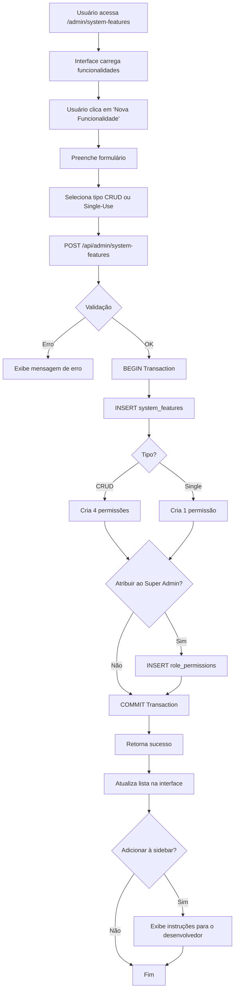

# 🎯 SISTEMA DE GESTÃO DE FUNCIONALIDADES

## 📋 RESUMO

Sistema completo para gerenciar funcionalidades do sistema administrativo, incluindo:
- ✅ Criação automática de permissões (CRUD ou Single-Use)
- ✅ Atribuição automática ao Super Admin
- ✅ Sugestão de adição à sidebar
- ✅ Interface intuitiva e profissional

---

## 🗂️ ESTRUTURA DE ARQUIVOS

### **Frontend**
```
src/app/admin/system-features/page.tsx
```
- Interface completa para gestão de funcionalidades
- Formulários de criação e edição
- Listagem com filtros e busca
- Badges de status (ativo/inativo)
- Contador de permissões

### **Backend API**
```
src/app/api/admin/system-features/route.ts
```
- **GET**: Lista todas as funcionalidades
- **POST**: Cria nova funcionalidade com permissões automáticas
- **PUT**: Atualiza funcionalidade existente
- **DELETE**: Remove funcionalidade (soft delete)

### **Tipos TypeScript**
```
src/lib/types/admin.ts
```
- Adicionado `'system-features': Permission` em `UserPermissions`
- Adicionado `'system-features'` em `Resource`

### **Mapeamento de Permissões**
```
src/lib/database/userPermissions.ts
```
- Função `mapCategoryToResource`: mapeamento de `'system-features'`

### **Sidebar**
```
src/components/admin/AdminSidebar.tsx
```
- Sub-opção "Funcionalidades" dentro de "Painel Administrativo"
- Acessível apenas para `Super Admin` e `Administrador`

---

## 🎨 FUNCIONALIDADES

### 1. **CRIAR NOVA FUNCIONALIDADE**

**Campos do Formulário:**
- **Nome**: Nome descritivo da funcionalidade (ex: "Contratos de Locação")
- **Descrição**: Descrição detalhada do que a funcionalidade faz
- **Categoria**: Categoria para agrupamento (ex: "contratos", "financeiro")
- **URL**: Rota de acesso (ex: "/admin/contratos")
- **Tipo**: 
  - `CRUD`: Cria 4 permissões (create, read, update, delete)
  - `Single-Use`: Cria 1 permissão (execute)

**Opções Adicionais:**
- ✅ **Atribuir ao Super Admin automaticamente**
- ✅ **Adicionar à sidebar** (gera instruções para o desenvolvedor)

**Processo Automático:**
```
1. Valida dados de entrada
2. Verifica se funcionalidade já existe
3. Cria registro em `system_features`
4. Cria permissões automaticamente:
   - CRUD: create, read, update, delete
   - Single-Use: execute
5. Se selecionado, atribui permissões ao Super Admin
6. Retorna sucesso com contagem de permissões criadas
```

### 2. **EDITAR FUNCIONALIDADE**

- Atualiza nome, descrição, categoria e URL
- **NÃO altera permissões** (gerenciadas em "Configurar Permissões")
- Botão "Editar" ao lado de cada funcionalidade

### 3. **ATIVAR/DESATIVAR FUNCIONALIDADE**

- Toggle visual para ativar/desativar
- Funcionalidades inativas:
  - Não aparecem na sidebar
  - Não são consideradas no sistema de permissões
  - Permanecem no banco para histórico

### 4. **EXCLUIR FUNCIONALIDADE**

- Confirmação obrigatória
- Remove funcionalidade e permissões associadas
- **ATENÇÃO**: Ação irreversível!

---

## 🔐 PERMISSÕES

### **Para Acessar a Página**
- Perfil: `Super Admin` ou `Administrador`
- Recurso: `system-features`
- Ação mínima: `READ`

### **Para Criar Funcionalidades**
- Ação: `WRITE` ou `ADMIN`

### **Para Excluir Funcionalidades**
- Ação: `DELETE` ou `ADMIN`

---

## 📊 ESTRUTURA DO BANCO DE DADOS

### **Tabela: `system_features`**
```sql
id              SERIAL PRIMARY KEY
name            VARCHAR(255) UNIQUE NOT NULL
description     TEXT
category        VARCHAR(100) NOT NULL
url             VARCHAR(255)
is_active       BOOLEAN DEFAULT TRUE
created_at      TIMESTAMP DEFAULT NOW()
updated_at      TIMESTAMP DEFAULT NOW()
```

### **Tabela: `permissions`**
```sql
id              SERIAL PRIMARY KEY
feature_id      INTEGER REFERENCES system_features(id) ON DELETE CASCADE
action          VARCHAR(50) NOT NULL  -- create, read, update, delete, execute
description     TEXT
created_at      TIMESTAMP DEFAULT NOW()
updated_at      TIMESTAMP DEFAULT NOW()
UNIQUE (feature_id, action)
```

### **Tabela: `role_permissions`**
```sql
role_id         INTEGER REFERENCES user_roles(id) ON DELETE CASCADE
permission_id   INTEGER REFERENCES permissions(id) ON DELETE CASCADE
granted_by      INTEGER REFERENCES users(id)
granted_at      TIMESTAMP DEFAULT NOW()
PRIMARY KEY (role_id, permission_id)
```

---

## 🚀 COMO USAR

### **PASSO 1: Acessar a Interface**
1. Login como `Super Admin` ou `Administrador`
2. Sidebar → "Painel Administrativo" → "Funcionalidades"

### **PASSO 2: Criar Nova Funcionalidade**
1. Clicar em "➕ Nova Funcionalidade"
2. Preencher formulário:
   - Nome: "Contratos de Locação"
   - Descrição: "Gerenciar contratos de locação de imóveis"
   - Categoria: "contratos"
   - URL: "/admin/contratos"
   - Tipo: CRUD
3. Marcar "Atribuir ao Super Admin" ✅
4. Marcar "Adicionar à sidebar" ✅ (opcional)
5. Clicar em "Criar Funcionalidade"

### **PASSO 3: Resultado**
```
✅ Funcionalidade "Contratos de Locação" criada com sucesso!
✅ 4 permissões geradas automaticamente:
   - create: Criar gestão de contratos de locação
   - read: Visualizar gestão de contratos de locação
   - update: Editar gestão de contratos de locação
   - delete: Excluir gestão de contratos de locação
✅ Permissões atribuídas ao Super Admin
```

### **PASSO 4: Próximas Ações**
1. **Atribuir permissões a outros perfis**:
   - Ir para "Gestão de Perfis" → Selecionar perfil → "Gerenciar Permissões"
   - OU ir para "Configurar Permissões" → Matriz de permissões

2. **Adicionar à sidebar** (se marcou a opção):
   - Seguir instruções exibidas na mensagem de sucesso
   - Editar `src/components/admin/AdminSidebar.tsx`
   - Adicionar novo item de menu

3. **Criar a página frontend**:
   - Criar `src/app/admin/contratos/page.tsx`
   - Implementar interface CRUD

4. **Criar APIs**:
   - Criar `src/app/api/admin/contratos/route.ts`
   - Implementar endpoints (GET, POST, PUT, DELETE)

---

## 🔄 FLUXO COMPLETO



---

## 🛠️ TIPOS DE FUNCIONALIDADES

### **1. CRUD (Create, Read, Update, Delete)**
**Exemplo**: Gestão de Contratos, Gestão de Imóveis, Gestão de Clientes

**Permissões Geradas**:
- `create`: Criar novos registros
- `read`: Visualizar registros
- `update`: Editar registros
- `delete`: Excluir registros

**Casos de Uso**:
- Qualquer funcionalidade que precise de listagem e manipulação de dados
- Cadastros em geral
- Gestão de entidades

### **2. Single-Use (Execução Única)**
**Exemplo**: Mudança de Status, Exportar Relatório, Sincronizar Dados

**Permissão Gerada**:
- `execute`: Executar a ação

**Casos de Uso**:
- Ações pontuais que não envolvem CRUD
- Operações em lote
- Processos específicos
- Integrações

---

## 📝 EXEMPLOS PRÁTICOS

### **Exemplo 1: Criar CRUD de Contratos**
```json
{
  "name": "Contratos de Locação",
  "description": "Gerenciar contratos de locação de imóveis",
  "category": "contratos",
  "url": "/admin/contratos",
  "type": "crud",
  "assignToSuperAdmin": true,
  "addToSidebar": true
}
```

**Resultado**:
- ✅ 4 permissões criadas (create, read, update, delete)
- ✅ Atribuídas ao Super Admin
- ✅ Instruções para adicionar à sidebar

### **Exemplo 2: Criar Funcionalidade de Exportação**
```json
{
  "name": "Exportar Relatório Financeiro",
  "description": "Exportar relatório financeiro em PDF ou Excel",
  "category": "relatorios",
  "url": "/admin/relatorios/exportar",
  "type": "single",
  "assignToSuperAdmin": true,
  "addToSidebar": false
}
```

**Resultado**:
- ✅ 1 permissão criada (execute)
- ✅ Atribuída ao Super Admin
- ✅ Sem instruções de sidebar (não marcado)

---

## ⚠️ ATENÇÕES

### **1. Categoria (category)**
- Use `kebab-case` (ex: "contratos", "tipos-imoveis")
- Será usada para agrupar funcionalidades
- Deve ser consistente com outras funcionalidades do sistema

### **2. URL**
- Sempre começar com `/admin/`
- Seguir padrão REST (ex: `/admin/contratos`, `/admin/contratos/[id]`)
- URL única (não pode duplicar)

### **3. Nome da Funcionalidade**
- Único no sistema
- Descritivo e claro
- Usar título (ex: "Contratos de Locação", não "contratos")

### **4. Excluir Funcionalidade**
- **Remove todas as permissões associadas** (CASCADE)
- **Remove atribuições de perfis**
- **NÃO remove a opção da sidebar** (deve ser feito manualmente)
- **Ação irreversível**

---

## 🔗 INTEGRAÇÃO COM OUTROS MÓDULOS

### **Gestão de Perfis** (`/admin/roles`)
- Ao criar uma funcionalidade, as permissões ficam disponíveis para atribuição
- Administradores podem atribuir essas permissões a qualquer perfil

### **Configurar Permissões** (`/admin/permissions`)
- As novas permissões aparecem automaticamente na matriz
- Permite atribuição em massa para múltiplos perfis

### **Sidebar**
- Funcionalidades com `addToSidebar = true` geram instruções
- Desenvolvedor deve editar manualmente `AdminSidebar.tsx`

---

## 📦 STATUS ATUAL

### ✅ **IMPLEMENTADO**
- [x] Interface completa de gestão
- [x] API CRUD de funcionalidades
- [x] Criação automática de permissões
- [x] Atribuição automática ao Super Admin
- [x] Validações de entrada
- [x] Filtros e busca
- [x] Badges de status
- [x] Contador de permissões
- [x] Integração com sistema de tipos
- [x] Mapeamento em `userPermissions.ts`

### 🚧 **PRÓXIMOS PASSOS** (Se necessário)
- [ ] Auditoria de criação/edição de funcionalidades
- [ ] Histórico de alterações
- [ ] Clonagem de funcionalidades
- [ ] Import/Export de funcionalidades
- [ ] Validação de URL duplicada mais robusta

---

## 🎓 CONCLUSÃO

Este sistema permite que **novos módulos sejam adicionados ao sistema de forma padronizada e automatizada**, garantindo:
- ✅ Permissões sempre criadas corretamente
- ✅ Super Admin sempre com acesso total
- ✅ Integração perfeita com o sistema de RBAC existente
- ✅ Documentação automática via interface

**Agora, sempre que precisar adicionar uma nova funcionalidade ao sistema, basta usar esta interface ao invés de inserir manualmente no banco de dados!**


