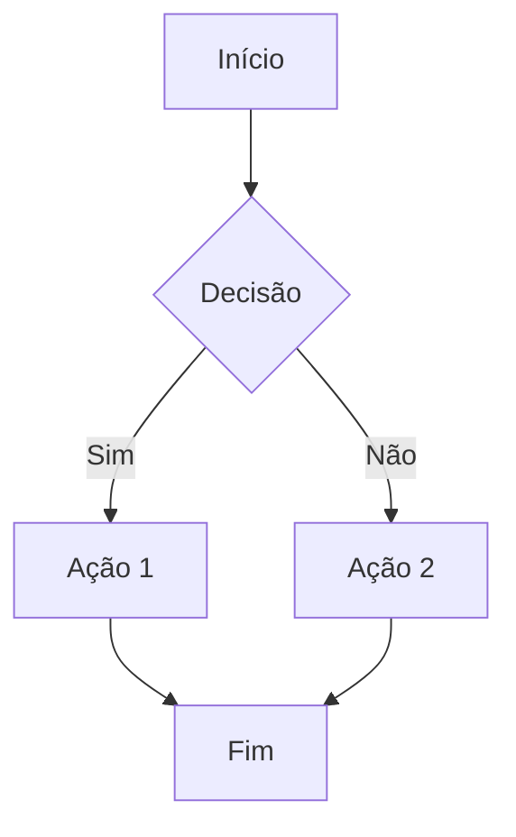
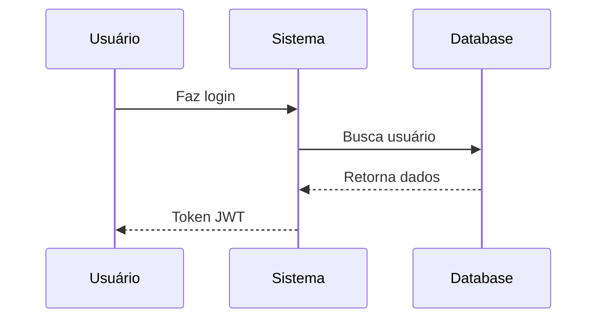
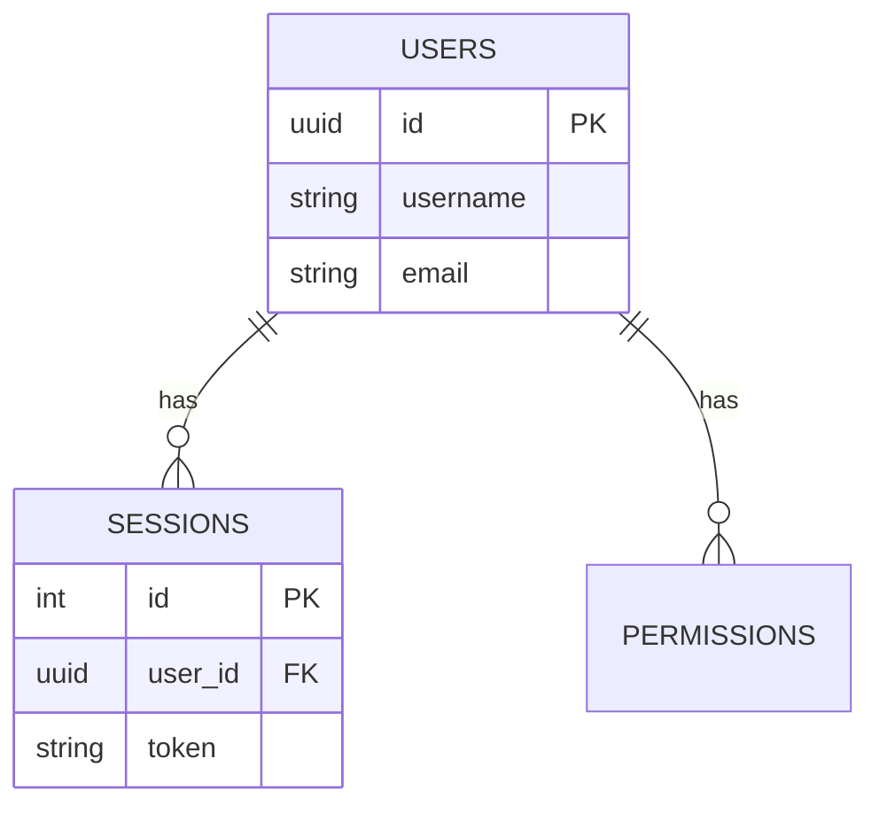
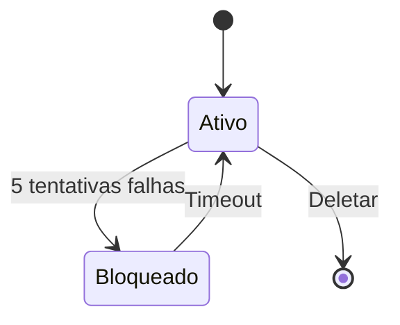

# 🧪 TESTE DE VISUALIZAÇÃO MERMAID

**Instruções:** 
1. Abra este arquivo no Cursor/VS Code
2. Pressione `Ctrl + Shift + V` (Preview)
3. Você deve ver os diagramas renderizados abaixo!

---

## Teste 1: Fluxograma Simples

**Se você vê um diagrama com caixas e setas acima, está funcionando! ✅**

---

## Teste 2: Diagrama de Sequência

**Se você vê um diagrama de sequência com linhas e mensagens, está funcionando! ✅**

---

## Teste 3: Diagrama ER

**Se você vê um diagrama de entidades com relacionamentos, está funcionando! ✅**

---

## Teste 4: Diagrama de Estados

**Se você vê um diagrama de estados com transições, está funcionando! ✅**

---

## ✅ RESULTADO ESPERADO

Se você está vendo **diagramas coloridos e bem formatados** em vez de apenas o código Mermaid, então:

🎉 **ESTÁ FUNCIONANDO PERFEITAMENTE!**

Agora você pode visualizar todos os diagramas nos documentos:
- `DIAGRAMAS_SISTEMA_SEGURANCA.md`
- `GUIA_ADICIONAR_NOVA_FUNCIONALIDADE.md`

---

## ❌ SE NÃO ESTIVER FUNCIONANDO

### No VS Code:
1. Instale a extensão: **Markdown Preview Mermaid Support**
2. Recarregue o VS Code
3. Abra o preview novamente (`Ctrl + Shift + V`)

### No Cursor:
- O Cursor já tem suporte nativo
- Se não funcionar, atualize para a versão mais recente

### Alternativa:
- Use o site: https://mermaid.live/
- Copie e cole o código Mermaid lá

