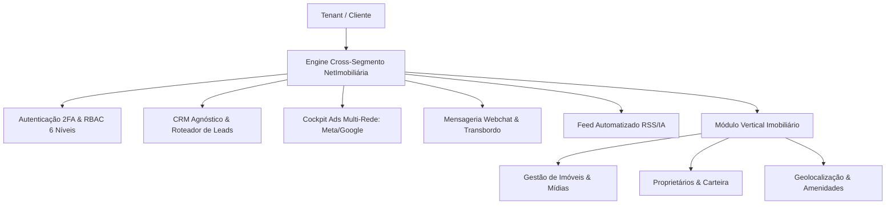

# 01 Visão Geral e Arquitetura Multi-Segmento

> **Camada de Fundação — Motores Cross-Segmento vs Módulos Verticais**

## 1. Princípios Arquiteturais

A plataforma **NetImobiliária** foi construída sob uma arquitetura híbrida de alto desempenho:

1. **Camada Horizontal (Cross-Segmento Agnóstica)**:
   - Os motores primários (CRM, Qualificação de Leads, Mensageria Webchat, Gestão de Campanhas Meta/Google Ads, Ingestão de Feeds e RBAC) são **100% desacoplados de regras imobiliárias**.
   - O código carrega abstrações genéricas. Toda a especialização por segmento de negócio (Imobiliário, Saúde, Educação, Serviços, Varejo, Automóveis) é gerida via configurações no banco de dados.

2. **Camada Vertical (Módulo Imobiliário)**:
   - Módulos especializados que plugam na camada horizontal para fornecer fichas técnicas de imóveis, gestão de proprietários, fotos/vídeos, geoprocessamento e publicação em portais.

---

## 2. Conceito Fundacional: Segmento ≠ Tenant

Para garantir escalabilidade comercial e técnica, a plataforma diferencia expressamente estes três conceitos:

* **Tenant (`tenant_id`)**: A empresa cliente assinante da plataforma SaaS (ex: Agência de Marketing, Holding ou Imobiliária Master).
* **Cliente (`cliente_id`)**: O cliente final atendido pelo Tenant (ex: uma imobiliária parceira, uma clínica ou uma concessionária gerida pela agência).
* **Segmento (`BusinessSegment`)**: A vertical de negócio associada ao cliente ou tenant (ex: `real_estate`, `healthcare`, `education`, `automotive`, `services`), que define o vocabulário, os prompts do LLM, os benchmarks de tráfego pago e as etapas de funil.

---

## 3. Configuração Dinâmica Sem Hardcoding

Nenhuma regra de negócio específica de um segmento é fixada no código TypeScript. O sistema armazena em JSONB no banco de dados:

* Prompts de Inteligência Artificial (System, User, Persona).
* Taxonomia de criativos (Hooks, ângulos de venda).
* Benchmarks numéricos de tráfego pago (CTR aceitável, CPL ideal por rede).
* Vocabulário dinâmico ("imóvel/valor" no Imobiliário vs "procedimento/consulta" na Saúde).
