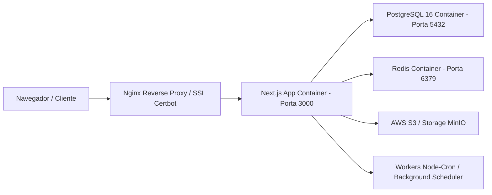

# 02 Tecnologias, Infraestrutura e DevOps

> **Especificação da Stack de Tecnologia, Containers, Banco de Dados e Serviços**

## 1. Stack Tecnológica Primária

A plataforma utiliza as seguintes tecnologias no ecossistema Node.js / TypeScript:

* **Framework Web & API**: Next.js 14 (App Router) em TypeScript 5.
* **ORM & Banco de Dados**: Prisma ORM 7.8 com PostgreSQL 16.
* **Cache & Mensageria Async**: Redis 7 via `ioredis` e `rate-limiter-flexible`.
* **Estilização & UI**: TailwindCSS 3.3, Componentes Radix / HeadlessUI, Framer Motion, Tabler / Heroicons / Phosphor / Material UI Icons.
* **Inteligência Artificial (LLMs)**: SDKs oficiais da Anthropic Claude (`@anthropic-ai/sdk`), OpenAI (`openai`) e Google Gemini (`@google/generative-ai`).
* **Tráfego Pago & APIs Externas**: `google-ads-api`, `google-trends-api`, Graph API Meta (Facebook Ads).
* **Processamento de Imagens & PDF**: `sharp`, `jspdf`, `pdf-lib`, `pdfkit`.

---

## 2. Infraestrutura & DevOps

A infraestrutura é orquestrada via **Docker Compose** e executada em servidores VPS Linux (Hostinger / Ubuntu 22.04 LTS).

### Serviços Docker Compose (`docker-compose.prod.yml` / `docker-compose.vps.yml`)

* **`web`**: Aplicação Next.js 14 em container Node 20 alpine.
* **`db`**: PostgreSQL 16 com extensões `unaccent` e `pg_trgm` para buscas textuais.
* **`redis`**: Instância Redis para armazenamento de sessões 2FA, rate limiting e filas.
* **`worker`**: Processador de tarefas em segundo plano (`feed-cron-processor.js`, `marketing-cron-scheduler.js`, `transbordo-scheduler.js`).

---

## 3. Ambientes e Variáveis de Configuração

* `.env.local`: Configurações de desenvolvimento local.
* `.env.production.example`: Modelo para variáveis de produção na VPS (Credenciais PostgreSQL, Secrets JWT, API Keys Anthropic/OpenAI/Google, AWS S3/MinIO, SMTP Gmail).
