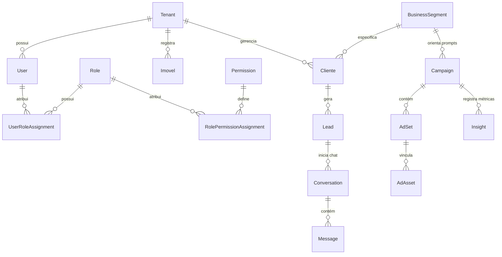

# 03 Modelo de Dados Relacional e Prisma ORM

> **Mapeamento de Schemas, Schemas PostgreSQL, Entidades Principais e Chaves Estrangeiras**

## 1. Organização por Schemas PostgreSQL

Para garantir o isolamento e a governança dos dados, o PostgreSQL é organizado nos seguintes schemas:

1. **`public`**: Entidades de segurança, usuários, perfis, logs, proprietários, clientes e preferências.
2. **`imobiliaria`**: Módulo vertical imobiliário (Imóveis, Amenidades, Proximidades, Documentos de Imóveis, Fichas Técnicas).
3. **`campanhasmarketingdigital`**: Módulo cross-segmento de Ads (Campanhas, AdSets, Ads, AdAssets, Insights, SearchTerms, Negativações, Benchmarks por `BusinessSegment`).
4. **`mensageria`**: Webchat, Conversas, Mensagens, Sessões Públicas, Roteamento e Transbordo de Leads.
5. **`feed`**: Feed de Notícias, Fontes RSS, Agendamentos e Postagens Sociais.

---

## 2. Diagrama de Relacionamentos Principais (ERD)

---

## 3. Principais Modelos Prisma (`prisma/schema.prisma`)

* **`User`**: Usuário do sistema (nível 1 a 6, campos 2FA TOTP/Email, `tenant_id`).
* **`Role` / `Permission` / `UserRoleAssignment`**: Sistema RBAC dinâmico e flexível.
* **`Imovel`**: Ficha do imóvel (título, preço, endereço, amenidades, status público 99/ativo, `dual_key` UUID).
* **`Lead` / `LeadEvent`**: Gestão de clientes em potencial, origem, qualificação e timeline de eventos.
* **`Campaign` / `AdSet` / `AdAsset`**: Cockpit de tráfego pago multi-rede (Meta e Google Ads).
* **`BusinessSegment`**: Tabela que armazena vocabulário, prompts e regras específicas por nicho de mercado.
