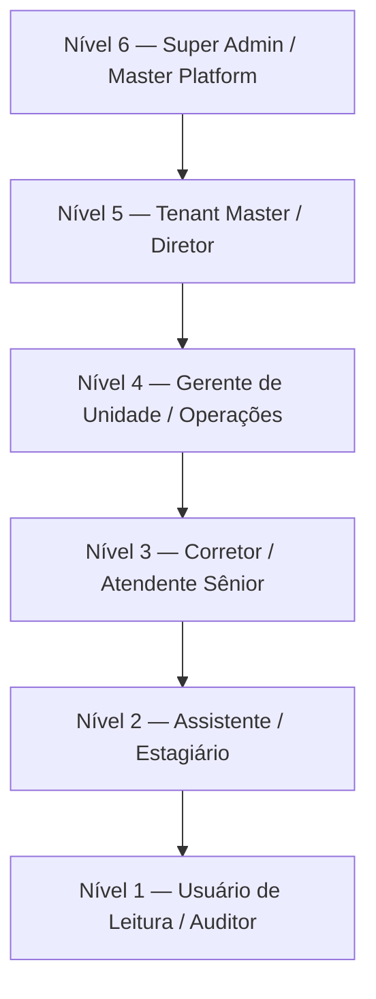
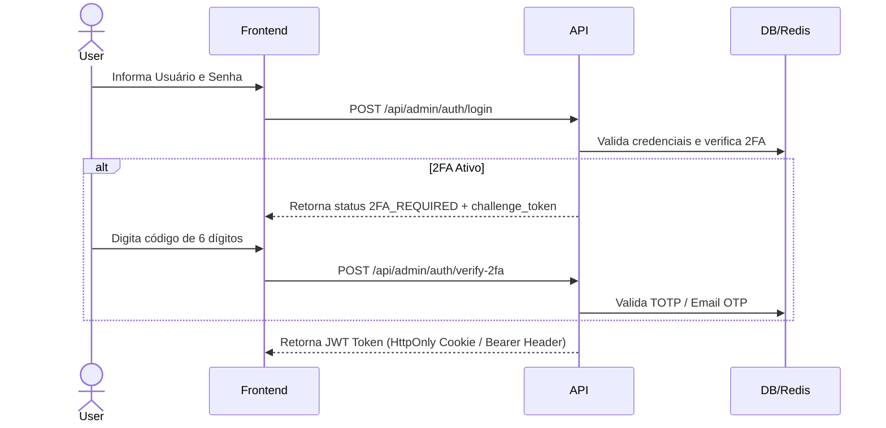

# 04 Autenticação, 2FA e RBAC Hierárquico (Níveis 1-6)

> **Mecanismos de Segurança, Níveis de Acesso, Autenticação de Dois Fatores e Middlewares**

## 1. Hierarquia de Níveis de Acesso (RBAC 1 a 6)

O sistema possui uma estrutura de controle de acesso hierárquica e granular dividida em **6 Níveis Primários**:

* **Nível 6 (Super Admin / Master)**: Acesso ilimitado a todas as rotas, configurações multi-tenant, auditorias e gestão de planos.
* **Nível 5 (Tenant Admin / Diretor)**: Gestão completa do tenant, criação de usuários (Níveis 1 a 5), acesso financeiro e de marketing.
* **Nível 4 (Gerente / Coordenador)**: Acesso a relatórios de equipe, aprovação de leads, gestão de imobiliárias e anúncios.
* **Nível 3 (Corretor / Operador de CRM)**: Gestão de seus próprios imóveis, carteira de clientes, mensageria e atendimento.
* **Nível 2 (Assistente)**: Atualização de cadastros e inserção de mídias sob supervisão.
* **Nível 1 (Leitura)**: Consulta restrita a relatórios de leitura sem permissão de modificação (`write`).

---

## 2. Autenticação de Dois Fatores (2FA)

Para garantir segurança reforçada, a plataforma suporta **2FA Obrigatório ou Opcional** via dois canais:

1. **TOTP (Aplicativos Autenticadores)**: Compatível com Google Authenticator, Authy e Microsoft Authenticator via QrCode gerado em `qrcode.react`.
2. **Email OTP**: Envio de código temporário de 6 dígitos via SMTP Gmail (`nodemailer`) com expiração de 10 minutos.

---

## 3. Protection Guards & Middlewares

Todas as rotas de API em `src/app/api/admin/` são protegidas por middlewares que realizam a validação em 3 etapas:
1. Validação de formato e assinatura do token JWT.
2. Verificação de sessão 2FA válida.
3. Checagem da tabela `RolePermission` (`hasPermission(user, resource, action)`).
