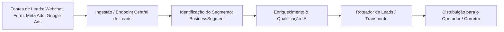

# 05 Módulo CRM Agnóstico e Qualificação de Leads

> **Motor de CRM Cross-Segmento, Roteador de Leads, Qualificação IA e Funis Dinâmicos**

## 1. Funcionamento do Motor CRM Agnóstico

O módulo de CRM opera de maneira **horizontal**, sem depender das regras de negócio do segmento. Ele gerencia o ciclo de vida completo de um lead desde a captação até a conversão.

---

## 2. Qualificação Automatizada por Inteligência Artificial

Quando um lead entra na plataforma, o motor chama o LLM configurado (Claude ou OpenAI) utilizando o contexto e vocabulário do `BusinessSegment`:

* **Análise de Intenção**: Identifica a urgência e o perfil do lead (ex: investidor no imobiliário vs emergência na saúde).
* **Pontuação de Score (0 a 100)**: Classifica o lead em *Quente*, *Morno* ou *Frio*.
* **Extração de Entidades**: Captura automaticamente orçamento, preferências, localização ou requisitos específicos.

---

## 3. Roteador de Leads e Robô de Transbordo

Para evitar que leads fiquem sem atendimento, o sistema possui um agendador automatizado (`transbordo-scheduler.js`):

1. **Atribuição Inicial**: O lead é atribuído ao operador ou corretor responsável pela região/anúncio.
2. **Tempo Limite de Atendimento**: Caso o operador não interaja dentro do prazo (ex: 15 minutos), o robô de transbordo executa a rotação automática (*Round-Robin*) repassando o lead para o próximo profissional disponível na fila.
3. **Notificação em Tempo Real**: Notifica a equipe via sistema e webchat.
