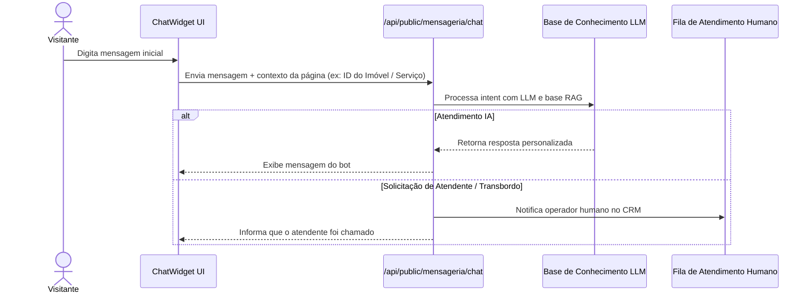

# 06 Mensageria Webchat Público e Robô de Transbordo

> **Widget de Chat Embutível, Protocolo de Transbordo de Leads, RAG e Contexto de Página**

## 1. Arquitetura do Widget de Chat Público (`ChatWidget.tsx`)

O módulo de mensageria disponibiliza um widget de chat dinâmico que pode ser embarcado tanto na aplicação pública quanto em sites parceiros:

---

## 2. Captura do Contexto da Página

O `ChatWidget` detecta dinamicamente a página em que o visitante se encontra:
* Na página do imóvel (`/imoveis/[id]`): O robô de IA lê a ficha técnica do imóvel no banco de dados e tira dúvidas sobre preço, bairro, quartos e condomínio.
* Em páginas de serviços ou institucionais: O robô utiliza a base de conhecimento geral do `BusinessSegment`.

---

## 3. Rate Limiting e Proteção Antibot

Para impedir abusos e ataques de negação de serviço na API pública de mensageria:
* Implementado **Rate Limit dedicado** com `rate-limiter-flexible` limitando a quantidade de mensagens por IP/minuto.
* Validação de captcha e sanificação de texto contra *prompt injection*.
