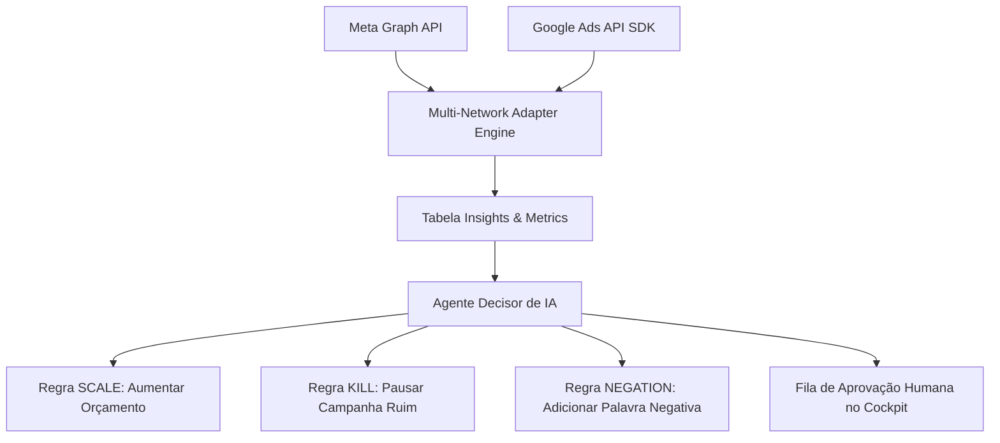

# 07 Cockpit Tráfego Pago (Meta/Google Ads) & Prompts

> **Cockpit Multi-Rede de Tráfego Pago, Agente Decisor Automatizado, Regras SCALE/KILL e Negativação**

## 1. Visão Geral do Cockpit de Ads em 3 Camadas

O módulo de Tráfego Pago centraliza a gestão de mídia paga das redes **Meta Ads (Facebook/Instagram)** e **Google Ads (Search & Performance Max)** em uma interface dividida em 3 camadas operacionais:

1. **Camada 1 — Visão Executiva (Command Center)**: Farol de saúde das campanhas, total gasto, CPL médio global, ROAS e alertas críticos.
2. **Camada 2 — Análise e Comparativo Multi-Rede**: Métricas lado a lado entre Meta e Google Ads, distribuição de orçamento e performance por anúncio.
3. **Camada 3 — Inteligência Profunda & Decisões**: Sugestões automáticas geradas pela IA para pausar anúncios ruins, aumentar orçamento de vencedores e negativar palavras irrelevantes.

---

## 2. Regras Automáticas do Agente Decisor (`agentDecisor.ts`)

* **Regra SCALE (Escalar Sucesso)**: Quando o CPL de uma campanha está 30% abaixo da média do `BusinessSegment` e com alta taxa de conversão, a IA sugere aumentar o orçamento diário em 15-20%.
* **Regra KILL (Interrupção de Prejuízo)**: Se uma campanha atinge 3x o CPL teto sem gerar leads qualificados, a IA sugere o envio de alerta de pausa.
* **Regra OPPORTUNITY_SHARE (Google Ads)**: Detecta perda de alcance no Google Search por restrição de orçamento (*Impression Share Lost to Budget*) e orienta o ajuste.
* **Regra NEGATION (Negativação Automática de Termos)**: Identifica pesquisas irrelevantes no Google Ads (ex: "grátis", "emprego", "curso") e gera a lista para negativação com 1 clique.

---

## 3. Gestão de Prompts Multi-Segmento (`BusinessSegment`)

Toda a geração de copys, títulos e descrições para os anúncios utiliza a tabela `BusinessSegment` no banco de dados. Isso garante que anúncios de imobiliárias usem tom imobiliário ("Confira esta casa dos sonhos"), enquanto anúncios de clínicas usem tom clínico ("Agende sua avaliação médica").
