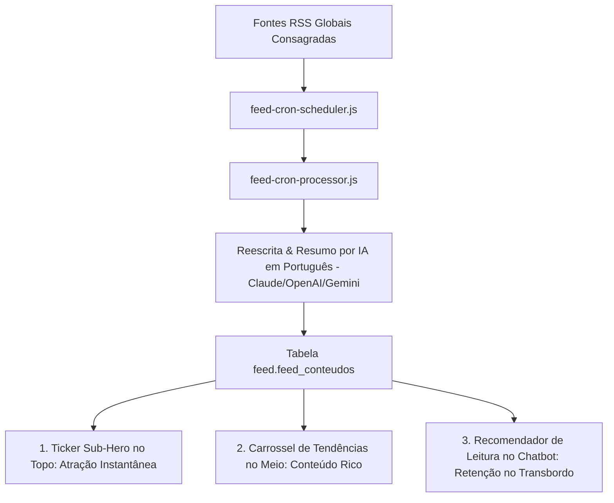

# 08 Módulo Feed Automatizado e Conteúdo IA

> **Ingestão RSS, Raspagem de Notícias por Nicho, Reescrita com IA, Arquitetura Híbrida de Exibição (CRO) e Retenção no Chatbot**

## 1. Arquitetura Geral do Gerador de Feed Automatizado

O módulo de Feed coleta, reescreve e agenda automaticamente postagens de notícias e conteúdos relevantes de acordo com o segmento configurado (`BusinessSegment`).

---

## 2. Arquitetura Híbrida de Exibição UX / CRO (Conversion Rate Optimization)

Para evitar o problema de perda de visualização (drop-off em mapas de calor no rodapé da página) sem roubar a atenção do botão principal de vendas (CTA), a exibição do feed adota a **Solução Híbrida em 3 Camadas**:

### Camada A: Live Ticker de Notícias (Sub-Hero Bar)
* **Localização**: Posicionado imediatamente abaixo do Hero principal da Landing Page (altura de 35px a 40px).
* **Comportamento**: Exibe um badge reluzente `[🔴 AO VIVO | INTELIGÊNCIA DE MERCADO]` acompanhado do título da notícia em rolagem suave.
* **Ação do Usuário**: Ao clicar no Ticker, o sistema realiza uma rolagem suave (*smooth scroll*) direcionando o internauta até o Carrossel de Tendências no meio da página.

### Camada B: Carrossel de Tendências (Seção Intermediária)
* **Localização**: Entremeado na metade da página (logo após as funcionalidades e antes dos Planos/Preços).
* **Comportamento**: Exibe 3 cards horizontais em formato de carrossel deslizante, contendo:
  * Badge da Categoria (ex: `[🎯 Tráfego Pago]`, `[🤖 IA & WhatsApp]`, `[📊 CRM & Vendas]`).
  * Título curto em 2 linhas + Resumo executivo de 1 linha.
  * Indicador de tempo de leitura (`⏱️ 2 min de leitura`).
  * Botão de expansão do artigo em modal.

### Camada C: Recomendação Automática de Leitura no Chatbot (Retenção no Transbordo)
* **Localização**: Widget de Chat Público (`ChatWidget.tsx`) e canal de atendimento.
* **Comportamento**: Quando um lead qualificado solicita um atendente humano e entra na fila de transbordo, o robô de IA dispara automaticamente uma sugestão de leitura contextualizada:
  > *"Enquanto transfiro seu atendimento para um de nossos especialistas (tempo estimado: 2 min), confira esta análise recente sobre estratégias de alta conversão..."*
* **Benefício de Marketing**: Aumenta o tempo de permanência do lead, reduz a percepção de tempo de espera e educa o cliente antes da interação com o corretor/operador.

---

## 3. Reescrita e Formatação Dinâmica por IA

O processador lê o artigo bruto das fontes consagradas globais e invoca a API de IA para produzir 3 variações em português fluente:
1. **Resumo Executivo**: Para exibição nos cards do carrossel intermediário.
2. **Copy para Redes Sociais / Chatbot**: Com hashtags estratégicas, emojis e call-to-action (CTA).
3. **Artigo Completo para Leitura / Modal**: Texto formatado em Markdown pronto para consumo do visitante.
