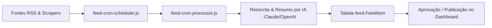

# 08 Módulo Feed Automatizado e Conteúdo IA

> **Ingestão RSS, Raspagem de Notícias por Nicho, Reescrita com IA e Agendador de Postagens**

## 1. Arquitetura do Gerador de Feed Automatizado

O módulo de Feed coleta, reescreve e agenda automaticamente postagens de notícias e conteúdos relevantes de acordo com o segmento configurado.

---

## 2. Ingestão e Processamento de Fontes

* **Leitor RSS (`rss-parser`)**: Varre feeds de portais parceiros e de notícias do setor em intervalos programados via cron (`node-cron`).
* **Tratamento de Imagens (`sharp`)**: Redimensiona, otimiza e faz o upload da imagem de capa para o armazenamento S3/MinIO.
* **Filtros de Qualidade**: Elimina notícias duplicadas via checagem de *hash* de título e URL.

---

## 3. Reescrita e Formatação Dinâmica por IA

O processador lê a notícia bruta e invoca a API de IA para produzir 3 variações de texto:
1. **Resumo Executivo**: Para exibição rápida em cards do dashboard.
2. **Copy para Redes Sociais (Instagram/LinkedIn/Facebook)**: Com hashtags estratégicas, emojis e call-to-action (CTA).
3. **Artigo Completo para Blog/Portal**: Texto formatado em Markdown pronto para publicação.
