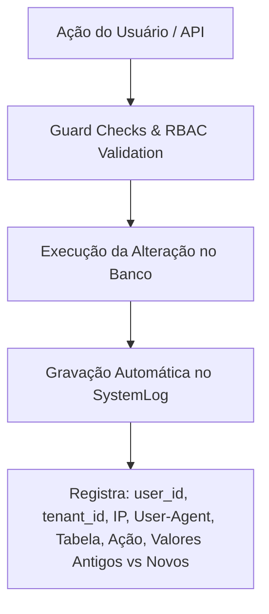

# 09 Cibersegurança, Auditoria, Logs e Guardian Rules

> **Mecanismos de Segurança Avançada, Conformidade LGPD, Trilhas de Auditoria e Validações Guardian**

## 1. Diretrizes de Segurança Avançada (Guardian Rules)

A plataforma obedece a um conjunto rigoroso de diretrizes de cibersegurança chamadas **Guardian Rules**:

* **Princípio da Menor Permissão (PoLP)**: Nenhuma rota ou API executa com acesso total por padrão; toda ação requer validação explícita no RBAC.
* **Proteção contra OWASP Top 10**: Validação e sanificação estrita de inputs contra SQL Injection, XSS e CSRF.
* **Mascaramento de Dados Sensíveis (LGPD)**: CPF, CNPJ, senhas, telefones e e-mails de clientes são mascarados em respostas de API públicas e arquivos de log.
* **Senhas Fortes & Hashing**: Utilização de `bcryptjs` com custo de hash de alta complexidade.

---

## 2. Trilha de Auditoria Universal (`SystemLog`)

Todas as ações críticas realizadas no sistema são gravadas de forma imutável na tabela `public.SystemLog`:

---

## 3. Retenção e Purging de Logs Automático

Para otimizar o banco de dados PostgreSQL sem comprometer os requisitos legais de auditoria:
* **Logs Ativos**: Mantidos no banco operacional por 90 dias.
* **Script de Purging (`auto-purge-logs.js`)**: Rotina periódica em Node.js / PowerShell que arquiva logs antigos em formato seguro compactado e limpa o banco.
