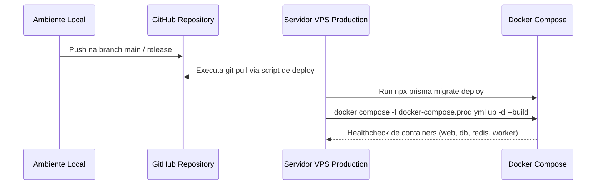

# 10 Plano de Testes, CI/CD e Rotinas de Backup

> **Estratégia de Validação Automática, Playwright, Scripts de Deploy e Disaster Recovery**

## 1. Estrutura de Testes e Validação

O projeto conta com suítes de validação automatizada e rotinas de teste end-to-end (E2E):

* **Testes de Integração & API**: Scripts em Node.js (`test-auth-apis.js`, `test-2fa-complete.js`, `test-permission-guards.js`) que exercitam as APIs HTTP com payload simulado.
* **Testes E2E com Playwright (`playwright`)**: Validação automatizada de fluxos de login, navegação por permissão de menu na Sidebar e submissão de formulários.
* **Validação de Schema e Compilação**: Verificação de tipos TypeScript (`tsc --noEmit`) e integridade de migrações Prisma (`npx prisma validate`).

---

## 2. Deploy Contínuo (DevOps / VPS)

O processo de atualização do servidor de produção (Hostinger VPS) é padronizado via scripts seguros:

---

## 3. Disaster Recovery & Estratégia de Backup

Para prevenir perda de dados e garantir alta disponibilidade:
* **Backup de Banco PostgreSQL (`backup-dia45-complete.js`)**: Realiza o dump diário do PostgreSQL compactado com carimbo de data/hora.
* **Restore Automatizado (`DOCKER_RESTORE_BANCO_LOCAL.md`)**: Roteiro e scripts prontos para restaurar a base de dados completa localmente ou em nova VPS em menos de 15 minutos em caso de falha grave.
