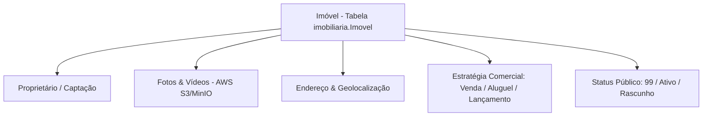

# 15 Gestão de Imóveis, Proprietários e Mídias

> **Especialização Vertical Imobiliária — Cadastro de Imóveis, Vínculo de Proprietários e Gestão de Mídias**

## 1. Módulo Vertical Imobiliário

O módulo vertical imobiliário estende os motores cross-segmento para fornecer o ecossistema completo de gestão patrimonial e negociação de imóveis.

---

## 2. Cadastro e Ficha Técnica do Imóvel

Cada imóvel possui uma ficha técnica rica armazenada no schema `imobiliaria`:
* **Dados Comerciais**: Valor de venda, valor de aluguel, condomínio, IPTU, comissão acordada.
* **Características Físicas**: Área útil, área total, quantidade de quartos, suítes, banheiros e vagas de garagem.
* **UUID e Dual Key (`dual_key`)**: Identificador único que garante a compatibilidade durante migrações e sincronizações com portais externos.
* **Status Público 99**: Sistema de controle de visibilidade pública que protege imóveis em fase de captação ou rascunho.

---

## 3. Gestão de Proprietários e Vínculos Legais

* **Identificação Única por CPF/CNPJ**: Impede a duplicação de cadastros de proprietários.
* **Modal de Edição Rápida**: Permite vincular ou alterar o proprietário diretamente da tela do imóvel.
* **Histórico de Captação**: Registra o corretor responsável pela captação do imóvel e os termos do contrato de mediação.

---

## 4. Gerenciamento de Fotos e Vídeos

* **Upload Arraste-e-Solte (`react-dropzone`)**: Permite upload em lote de imagens de alta resolução.
* **Otimização Automática (`sharp`)**: Gera versões comprimidas em formato WebP e thumbnails para carregamento ultra-rápido no portal público.
* **Ordenação Drag-and-Drop (`@dnd-kit`)**: Permite reordenar a sequência de fotos (definindo a foto de capa primária).
