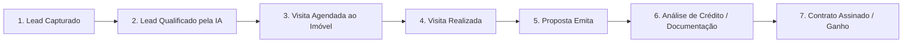

# 17 Jornada e Funil Específico Imobiliário

> **Funil de Venda/Aluguel, Etapas do Cliente, Proposta Comercial e Gestão de Propostas**

## 1. Funil de Vendas Imobiliário

A jornada do cliente interessado em comprar ou alugar um imóvel é mapeada no CRM através de fases bem definidas:

---

## 2. Emissão de Propostas e Ficha Comercial

* **Proposta Comercial Digital**: Permite ao corretor registrar a proposta do cliente (valor oferecido, forma de pagamento, entrada, financiamento, permuta).
* **Notificação ao Proprietário**: Notifica o proprietário para aceite, recusa ou contraproposta.
* **Geração de PDF (`jspdf`)**: Gera o termo de proposta assinado em PDF com marca d'água da imobiliária.

---

## 3. Gestão de Chaves e Visitas

* **Agendamento com Confirmação SMS/WhatsApp**: Dispara lembretes automáticos para o cliente e para o corretor 2 horas antes da visita.
* **Feedback Pós-Visita**: Registra no CRM a avaliação do cliente sobre o imóvel visitado para orientar o proprietário sobre preço e apresentação.
