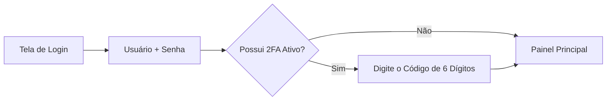

# 20 Visão Geral do Painel e Primeiros Passos

> **Manual do Usuário — Guia do Operador para Primeiro Acesso e Navegação no Dashboard**

## 1. Bem-vindo ao Painel NetImobiliária

Este manual foi elaborado para ensinar você, operador ou administrador, a utilizar com segurança e máxima eficiência todas as funcionalidades da aplicação.

---

## 2. Realizando o Primeiro Login

1. Acesse o endereço do seu sistema (ex: `https://seu-dominio.com.br/admin/login`).
2. Digite seu **Usuário/E-mail** e **Senha**.
3. Clique em **Entrar**.

* **Autenticação em Dois Fatores (2FA)**: Se o seu perfil exigir 2FA, um código de 6 dígitos será solicitado. Abra seu aplicativo autenticador (Google Authenticator) ou verifique seu e-mail para digitar o código.

---

## 3. Entendendo a Barra Lateral (Sidebar Dinâmica)

A barra lateral à esquerda exibe apenas os módulos aos quais o seu nível de acesso (Nível 1 a 6) tem permissão de visualizar:

* 📊 **Dashboard Executivo**: Visão geral de métricas, leads e anúncios.
* 🏠 **Imóveis**: Cadastro, consulta e gestão de mídias (Módulo Imobiliário).
* 👥 **Clientes & Proprietários**: Carteira de contatos.
* 💬 **CRM & Mensageria**: Atendimento a leads e Webchat.
* 🎯 **Tráfego Pago (Cockpit Ads)**: Gestão de campanhas Meta e Google Ads.
* 📰 **Feed Automatizado**: Notícias e postagens geradas por Inteligência Artificial.
* 🔐 **Segurança & Usuários**: Gestão de colaboradores e permissões (Administradores).

---

## 4. Como Alterar Seu Perfil e Senha

1. No canto superior direito, clique no seu nome/foto de perfil.
2. Selecione **Meu Perfil**.
3. Altere suas informações pessoais ou clique em **Alterar Senha**.
4. Ative a **Autenticação 2FA** escaneando o QR Code na tela com o seu celular.
