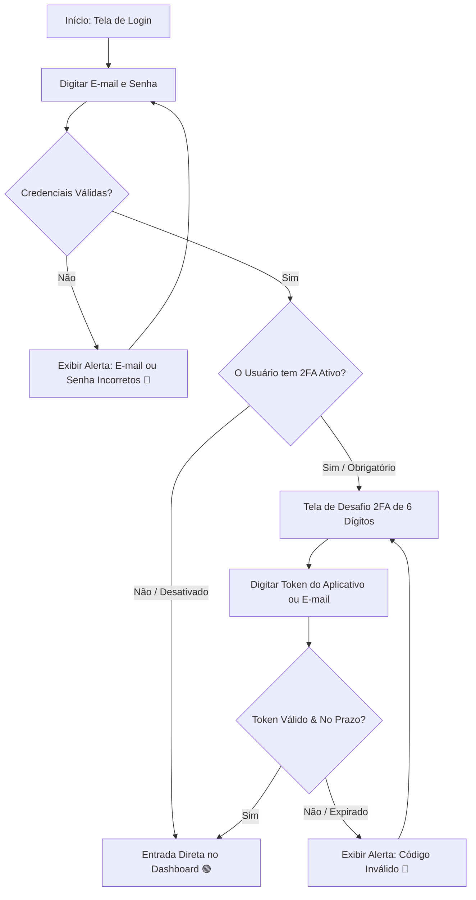

# 20 Visão Geral do Painel e Primeiros Passos

> **Manual do Usuário — Guia Ilustrado de Primeiro Acesso, Navegação na Sidebar e Configuração de Perfil**

---

## 1. Visão Geral da Interface Principal

A plataforma NetImobiliária foi projetada com uma interface moderna, responsiva e intuitiva. Abaixo está a representação visual da estrutura do painel após o login efetuado com sucesso:

```
+---------------------------------------------------------------------------------------------------------+
| [LOGO NETIMOBILIÁRIA]   [Seletor de Tenant/Cliente v]   [Busca Global... 🔍]    [🟢 Online] [Perfil v]  |
+----------------------+----------------------------------------------------------------------------------+
| BARRA LATERAL        | PAINEL PRINCIPAL DE CONTEÚDO                                                     |
|                      |                                                                                  |
| 📊 Dashboard         |  +----------------------------------------------------------------------------+  |
| 🏠 Imóveis           |  | 📊 Visão Geral Executiva                                                    |  |
| 👥 Clientes          |  +---------------+---------------+---------------+---------------+-------------+  |
| 💬 CRM & Leads       |  | Gasto Total   | CPL Médio     | Leads Totais  | ROAS Geral    | Farol       |  |
| 🎯 Tráfego Pago      |  | R$ 14.850,00  | R$ 18,50      | 803 Leads     | 4.2x          | 🟢 Saudável |  |
| 📰 Feed Notícias     |  +---------------+---------------+---------------+---------------+-------------+  |
| ⚙️ Configurações     |                                                                                  |
| 🔐 Segurança (RBAC)  |  +-------------------------------------+  +----------------------------------+  |
|                      |  | 📈 Desempenho por Rede (Meta/Google) |  | 🤖 Sugestões do Agente IA (3)    |  |
|                      |  | [ Gráfico de Linhas ]                 |  | [Aprovar SCALE +15%]             |  |
|                      |  +-------------------------------------+  +----------------------------------+  |
+----------------------+----------------------------------------------------------------------------------+
```

---

## 2. Fluxo Completo de Autenticação e Segurança (2FA)

O acesso ao sistema utiliza duplo fator de verificação (2FA) para proteção contra acessos não autorizados.

### Diagrama de Processo de Autenticação



---

## 3. Instruções de Preenchimento da Tela de Login

Abaixo encontra-se a matriz detalhada de preenchimento dos campos da tela de autenticação:

| Campo na Tela | Tipo de Dado | Obrigatoriedade | Regra de Preenchimento | Exemplo Válido |
| :--- | :--- | :--- | :--- | :--- |
| **E-mail / Usuário** | Texto / E-mail | **Obrigatório** | Deve ser um e-mail válido cadastrado no sistema. | `operador@suaempresa.com.br` |
| **Senha de Acesso** | Senha | **Obrigatório** | Mínimo de 8 caracteres contendo letras e números. | `••••••••••••` |
| **Manter Conectado** | Checkbox | Opcional | Se marcado, mantém a sessão ativa por 24 horas neste navegador. | `[X] Marcado` |
| **Código 2FA (6 dígitos)** | Numérico | **Se Ativo** | Token numérico de 6 dígitos gerado pelo Google Authenticator ou E-mail OTP. | `482910` |

> [!NOTE]
> Se você errar a senha 5 vezes consecutivas, a conta será temporariamente bloqueada por 15 minutos por medidas de segurança de força bruta.

---

## 4. Interpretação dos Elementos do Header (Cabeçalho Superior)

Na barra superior do sistema, você encontrará os seguintes indicadores e seletores:

```
[Seletor de Tenant/Cliente: Agência Imovtec v]  [Status da Conexão: 🟢 Online]  [Perfil: Paulo Silva v]
```

1. **Seletor de Tenant / Cliente**:
   * Permite alternar entre diferentes empresas ou clientes atendidos. Se você administra mais de uma unidade ou cliente, clique no menu suspenso para trocar a visualização de dados sem precisar fazer logout.
2. **Status da Conexão (🟢 Online / 🔴 Offline)**:
   * Indica a sincronização em tempo real com os servidores da API. Se ficar vermelho, verifique sua conexão de internet.
3. **Menu de Perfil do Usuário**:
   * Exibe sua foto de perfil, seu nome e seu Nível de Acesso RBAC (ex: *Nível 4 — Gerente*).
   * Dá acesso às telas **Meu Perfil**, **Configurar 2FA** e **Sair (Logout)**.

---

## 5. Navegação pela Sidebar Dinâmica (Menu Lateral)

A barra lateral é adaptativa e exibe apenas as opções autorizadas para o seu Nível de Acesso (RBAC 1 a 6):

```
📊 Dashboard           -> Visão geral das métricas executivas, farol e atalhos rápidos.
🏠 Imóveis             -> Cadastro, busca, mídias e gestão da carteira imobiliária.
👥 Clientes            -> Gestão de proprietários e compradores.
💬 CRM & Leads         -> Kanban de atendimento, fila de leads e Webchat público.
🎯 Tráfego Pago        -> Cockpit de campanhas Meta/Google Ads e sugestões da IA.
📰 Feed Notícias       -> Gerador de postagens automatizado com Inteligência Artificial.
⚙️ Configurações       -> Parâmetros globais do sistema e segmentos (`BusinessSegment`).
🔐 Segurança (RBAC)    -> Gestão de usuários, papéis e auditoria (Exclusivo Nível 5 e 6).
```

> [!TIP]
> Você pode recolher a barra lateral clicando no ícone de seta `[<]` no rodapé da Sidebar para ganhar mais espaço de visualização em telas menores ou notebooks.
