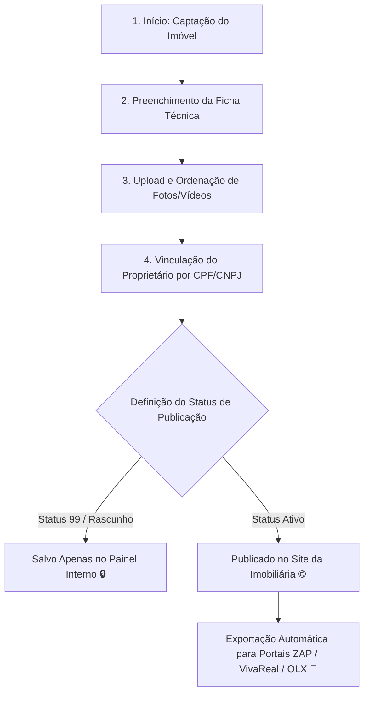

# 21 Operação Completa da Vertical Imobiliária

> **Manual do Usuário — Guia Ilustrado de Cadastro de Imóveis, Gestão de Mídias, Proprietários e Publicação**

---

## 1. Fluxo do Ciclo de Vida do Imóvel

O processo de entrada, tratamento de mídias e publicação de um imóvel na plataforma segue um fluxo auditado em 6 etapas:



---

## 2. Interface Visual da Ficha do Imóvel (`/admin/imoveis/novo`)

Abaixo está o esquema visual do formulário de cadastro de imóveis:

```
+---------------------------------------------------------------------------------------------------------+
|  🏠 CADASTRO DE NOVO IMÓVEL                                        [Status: 🟡 STATUS 99 (RASCUNHO) v]  |
+---------------------------------------------------------------------------------------------------------+
|  [Aba 1: Dados Básicos]  [Aba 2: Localização]  [Aba 3: Mídias & Fotos]  [Aba 4: Proprietário]            |
+---------------------------------------------------------------------------------------------------------+
|                                                                                                         |
|  * Título do Anúncio:                                                                                   |
|  [ Excelente Apartamento 3 Quartos com Varanda Gourmet em Boa Viagem                       ]            |
|                                                                                                         |
|  * Finalidade Comercial:              * Tipo do Imóvel:                                                 |
|  (X) Venda   ( ) Aluguel   ( ) Ambos  [ Apartamento               v ]                                   |
|                                                                                                         |
|  * Valor de Venda (R$):    * Condomínio (R$):    * IPTU Mensal (R$):   * Comissão (%):                 |
|  [ 750.000,00         ]    [ 850,00            ]   [ 220,00            ]   [ 5.0              ]          |
|                                                                                                         |
|  * Área Útil (m²):  * Área Total (m²):  * Quartos:  * Suítes:  * Banheiros:  * Vagas:                    |
|  [ 92.5          ]  [ 110.0          ]  [ 3      ]  [ 1     ]  [ 2        ]  [ 2    ]                    |
|                                                                                                         |
|  +---------------------------------------------------------------------------------------------------+  |
|  | 📸 ÁREA DE UPLOAD DE FOTOS (Arraste aqui suas imagens em alta resolução)                           |  |
|  | [ Foto 1 (CAPA) ]  [ Foto 2 ]  [ Foto 3 ]  [ Foto 4 ]   [ + Adicionar Mais Fotos ]                |  |
|  +---------------------------------------------------------------------------------------------------+  |
|                                                                                                         |
|  [ Salvar Rascunho (Status 99) ]                             [ 🚀 SALVAR E PUBLICAR (ATIVO) ]           |  |
+---------------------------------------------------------------------------------------------------------+
```

---

## 3. Matriz de Preenchimento Campo a Campo

A tabela abaixo descreve detalhadamente cada campo da ficha técnica do imóvel, sua obrigatoriedade e validação:

| Nome do Campo | Tipo de Input | Obrigatoriedade | Regra de Validação / Formato | Impacto no Sistema / Portais |
| :--- | :--- | :--- | :--- | :--- |
| **Título do Anúncio** | Texto Livre | **Obrigatório** | Mínimo 15 caracteres. Descrever tipo, bairros e atributos. | Exibido como título principal no site e portais. |
| **Finalidade** | Seleção Única | **Obrigatório** | Selecionar *Venda*, *Aluguel* ou *Ambos*. | Define em quais filtros de busca o imóvel aparecerá. |
| **Tipo do Imóvel** | Dropdown | **Obrigatório** | Selecionar: *Apartamento*, *Casa*, *Terreno*, *Comercial*. | Mapeia as categorias aceitas pelos portais ZAP/OLX. |
| **Valor de Venda (R$)** | Moeda (R$) | Se Venda | Valor numérico positivo em Reais. | Utilizado no cálculo de VGV e ordenação por preço. |
| **Valor de Aluguel (R$)** | Moeda (R$) | Se Aluguel | Valor numérico positivo em Reais. | Exibido como valor mensal no contrato de locação. |
| **Condomínio / IPTU** | Moeda (R$) | Opcional | Valores numéricos positivos em Reais. | Exibidos no detalhamento de despesas do imóvel. |
| **CEP do Imóvel** | Máscara `00000-000` | **Obrigatório** | CEP válido dos Correios. | Preenche automaticamente Rua, Bairro e Cidade via API. |
| **Número da Agulha** | Texto | **Obrigatório** | Número do prédio/casa. | Mantido confidencial na busca pública por privacidade. |
| **Área Útil (m²)** | Decimal | **Obrigatório** | Valor em metros quadrados (ex: `85.5`). | Utilizado no cálculo de R$/m² no analytics. |
| **Quartos / Suítes / Vagas** | Inteiro | **Obrigatório** | Valores inteiros maiores ou iguais a 0. | Filtros primários de busca no site e portais. |

---

## 4. Interpretação dos Status de Publicação

```
[🟡 STATUS 99 (RASCUNHO)]       [🟢 STATUS ATIVO]       [🔴 STATUS ARQUIVADO]
```

1. **Status 99 — Rascunho / Em Captação**:
   * O imóvel é visível **exclusivamente para a equipe interna** cadastrada no sistema.
   * Não aparece na busca pública do site nem é enviado nos arquivos XML para os portais (ZAP, VivaReal, OLX).
   * **Quando usar**: Imóveis que ainda aguardam fotos profissionais, assinatura do contrato de autorização com o proprietário ou conferência de certidões.

2. **Status Ativo — Publicado**:
   * O imóvel fica **imeditamente disponível no site público** e na API de busca.
   * Entra na fila automática de exportação para os portais imobiliários credenciados.

3. **Status Arquivado / Vendido / Alugado**:
   * Retira o imóvel das buscas públicas, mas preserva o histórico de propostas e comissões no banco de dados para relatórios estatísticos.

---

## 5. Instruções Passo a Passo para Upload e Ordenação de Fotos

1. Na aba **Mídias & Fotos**, clique no botão **Adicionar Fotos** ou arraste arquivos nos formatos `.jpg`, `.png` ou `.webp` (tamanho máximo recomendável de 10MB por foto).
2. O sistema aplicará automaticamente a compressão WebP e gerará os mini-thumbnails.
3. **Definir a Foto de Capa**: Arraste a melhor foto do imóvel (ex: Fachada ou Sala principal) para a **primeira posição (posição 1)**. A foto da posição 1 receberá a badge visual `[⭐ CAPA PRINCIPAL]`.
4. **Excluir Fotos**: Passe o mouse sobre a foto e clique no ícone da **Lixeira 🗑️**.

> [!IMPORTANT]
> Imóveis sem fotos ou com menos de 3 imagens registradas não serão exportados para os portais ZAP/VivaReal devido às regras de qualidade mínima dos portais.
