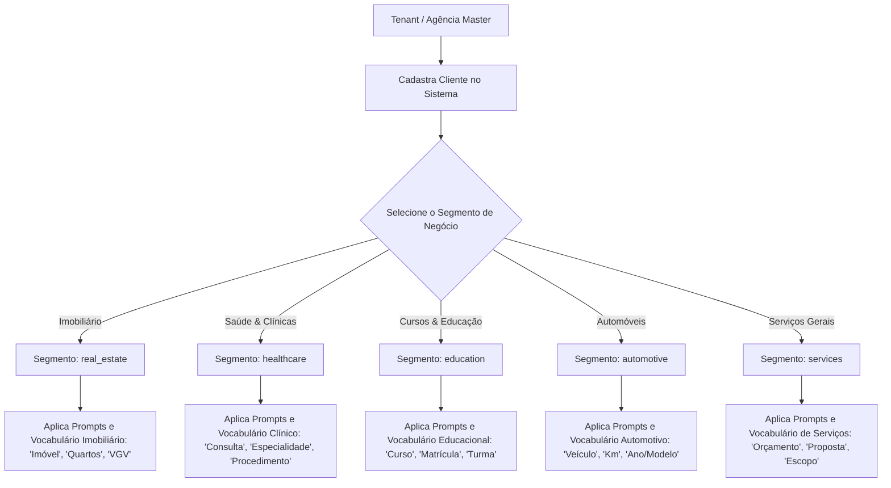

# 22 Operação para Outros Segmentos (Saúde, Serviços, etc.)

> **Manual do Usuário — Guia Ilustrado de Operação da Plataforma em Outros Segmentos de Negócio**

---

## 1. Princípio da Arquitetura Multi-Segmento

A plataforma NetImobiliária foi projetada com uma fundação **100% agnóstica**, operando sob o conceito **Segmento ≠ Tenant**:

* **Tenant**: Sua empresa / agência / empresa master assinante da plataforma.
* **Cliente**: Cada empresa atendida pelo seu tenant (ex: uma clínica, um curso, uma concessionária ou uma imobiliária).
* **Segmento (`BusinessSegment`)**: A vertical de negócio que define dinamicamente os vocabulários, prompts da Inteligência Artificial, etapas de funil e métricas de tráfego pago.

---

## 2. Diagrama de Vinculação de Segmentos e Prompts de IA



---

## 3. Interface Visual do Seletor de Cliente e Segmento

Abaixo está o esquema visual dos seletores no cabeçalho do painel:

```
+---------------------------------------------------------------------------------------------------------+
| [SELETOR DE CLIENTE: 🏥 Grupo Saúde Vida v]   [SEGMENTO ATIVO: 💉 Saúde & Medicina (healthcare) v]       |
+---------------------------------------------------------------------------------------------------------+
|                                                                                                         |
|  📋 PAINEL ADAPTATIVO — SEGMENTO SAÚDE & MEDICINA                                                       |
|  +------------------------+------------------------+------------------------+------------------------+  |
|  | Consultas Agendadas    | CPL Médio (Google/Meta)| Novas Avaliações       | Taxa de Comparecimento |  |
|  | 142 Agendamentos       | R$ 14,20               | 38 Pacientes           | 89,4%                  |  |
|  +------------------------+------------------------+------------------------+------------------------+  |
|                                                                                                         |
|  💬 ATENDIMENTOS DE LEADS DA CLÍNICA                                                                    |
|  [ Lead: Dra. Maria (Ortopedia) ]  [ Dúvida: Valor da Consulta ]  [ Status: 🟡 Agendamento Pendente ]  |
+---------------------------------------------------------------------------------------------------------+
```

---

## 4. Matriz de Mapeamento de Vocabulário por Segmento

A tabela a seguir demonstra como os termos do sistema se adaptam automaticamente em tempo real sem necessidade de alterar o código:

| Termo Genérico | Segmento Imobiliário (`real_estate`) | Segmento Saúde (`healthcare`) | Segmento Educação (`education`) | Segmento Automotivo (`automotive`) |
| :--- | :--- | :--- | :--- | :--- |
| **Objeto Principal** | Imóvel / Apartamento | Consulta / Procedimento | Curso / Graduação | Veículo / Carro |
| **Atributo 1** | Área útil (m²) | Especialidade Médica | Carga Horária | Quilometragem (km) |
| **Atributo 2** | Quartos / Vagas | Convênio / Particular | Modalidade (EAD/Presencial) | Ano / Modelo |
| **Valor Comercial** | Preço de Venda (R$) | Valor da Consulta (R$) | Mensalidade (R$) | Preço da Tabela FIPE (R$) |
| **Etapa do Funil** | Visita ao Imóvel | Avaliação Presencial | Aula Experimental | Test-Drive |
| **Ação do Lead** | Agendar Visita | Marcar Consulta | Garantir Vaga | Solicitar Simulação |

---

## 5. Como Configurar um Novo Cliente em Outro Segmento

1. Acesse **Configurações** ➔ **Gerenciar Clientes**.
2. Clique em **+ Novo Cliente**.
3. No formulário de cadastro, preencha o Nome da Empresa (`ex: Clínica Médica São Lucas`).
4. No campo **Segmento de Negócio**, selecione a opção desejada na lista suspensa (ex: `Saúde & Medicina`).
5. Ao salvar, a plataforma irá:
   * Carregar automaticamente a biblioteca de prompts ajustada para aquele nicho.
   * Adaptar os campos do Webchat público e dos formulários de entrada.
   * Ajustar os benchmarks de tráfego pago (CPL e CTR esperado para o segmento de saúde).
