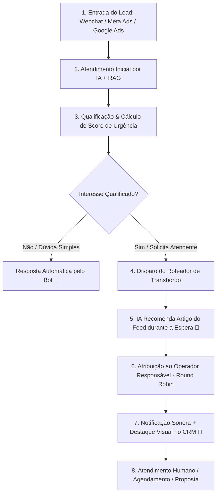

# 23 Gestão de CRM, Fila de Leads e Webchat

> **Manual do Usuário — Guia Ilustrado de Operação do CRM Kanban, Fila de Leads, Webchat Público, Transbordo e Recomendação de Feed**

---

## 1. Fluxo de Vida do Lead no CRM

O gerenciamento de oportunidades segue um fluxo automatizado que une Inteligência Artificial, recomendação de conteúdo e atendimento humano:



---

## 2. Interface Visual do Quadro Kanban (`/admin/crm/kanban`)

Abaixo encontra-se a representação do quadro Kanban de atendimento a leads:

```
+---------------------------------------------------------------------------------------------------------+
|  💬 QUADRO KANBAN DE LEADS      [Filtro Período: 30 Dias v]   [Origem: Todas v]   [+ Criar Lead Manual] |
+---------------------------------------------------------------------------------------------------------+
|  NOVO LEAD (4)      | EM QUALIFICAÇÃO (3) | VISITA AGENDADA (2) | PROPOSTA (1)      | GANHO (12)        |
+---------------------+---------------------+---------------------+-------------------+-------------------+
| [🔴 SCORE 95 - HOT] | [🟡 SCORE 65 - WARM]| [🔴 SCORE 98 - HOT] | [🔴 SCORE 92 - HOT]| [🟢 CONCLUÍDO]    |
| João Carlos Silva   | Ana Paula Oliveira  | Carlos Eduardo      | Mariana Rios      | Roberto Mendonça  |
| Interesse: Apt 3Q   | Interesse: Casa     | Imóvel #145         | Proposta: R$ 720k | Compra Concluída  |
| Há 5 minutos ⏱️     | Há 12 minutos ⏱️    | Visita: Amanhã 15h  | Ag: Paulo Silva   | Comissão: R$ 36k  |
| 👤 Paulo Silva      | 👤 Sem Dono         | 👤 Paulo Silva      | 👤 Paulo Silva    | 👤 Ana Lima       |
| [📞 Ligar] [💬 Chat]| [📞 Ligar] [💬 Chat]| [📞 Ligar] [💬 Chat]| [📞 Ligar] [💬 Chat]| [📄 Ver Contrato] |
+---------------------+---------------------+---------------------+-------------------+-------------------+
```

---

## 3. Tela de Atendimento ao Vivo, Transbordo e Recomendação de Feed

Ao clicar em **[💬 Chat]** no card do lead, a janela de atendimento em tempo real exibe a interação entre o robô e o visitante:

```
+---------------------------------------------------------------------------------------------------------+
|  💬 CHAT COM: João Carlos Silva (Lead #803)                  [👤 Atribuído: Paulo Silva] [Assumir Chat] |
+---------------------------------------------------------------------------------------------------------+
|  🤖 [BOT IA]: Olá João! Vi que você se interessou pela nossa solução de automação de atendimentos.      |
|  👤 [JOÃO]: Sim! Gostaria de saber os valores e falar com um consultor.                                 |
|  🤖 [BOT IA]: Perfeito! Estou transferindo você para o especialista Paulo Silva.                        |
|  📰 [BOT IA]: Enquanto ele conecta (tempo est. 1 min), confira esta leitura rápida sobre IA e ROI:     |
|              👉 "Como Empresas Reduziram em 60% o Tempo de Resposta com Chatbots Inteligentes"          |
|  ------------------ 🔔 SISTEMA: TRANSBORDO EXECUTADO - CHAT TRANSFERIDO PARA PAULO -------------------  |
|  👨‍💼 [PAULO SILVA]: Olá João! Tudo bem? Sou o Paulo, como posso te ajudar com a sua operação?            |
+---------------------------------------------------------------------------------------------------------+
|  [ Digite sua mensagem aqui...                                                         ]  [ Enviar 🚀 ] |
+---------------------------------------------------------------------------------------------------------+
```

### Regras do Recomendador de Feed no Chatbot:
1. Assim que o transbordo para o operador humano é acionado, o robô consulta no banco `feed.feed_conteudos` o artigo mais recente e relevante para o segmento do lead.
2. O bot envia o link e o resumo de 1 linha do artigo na conversa.
3. Isso **retém a atenção do lead**, diminui a percepção de tempo de espera e educa o cliente antes da conversa com o consultor.
