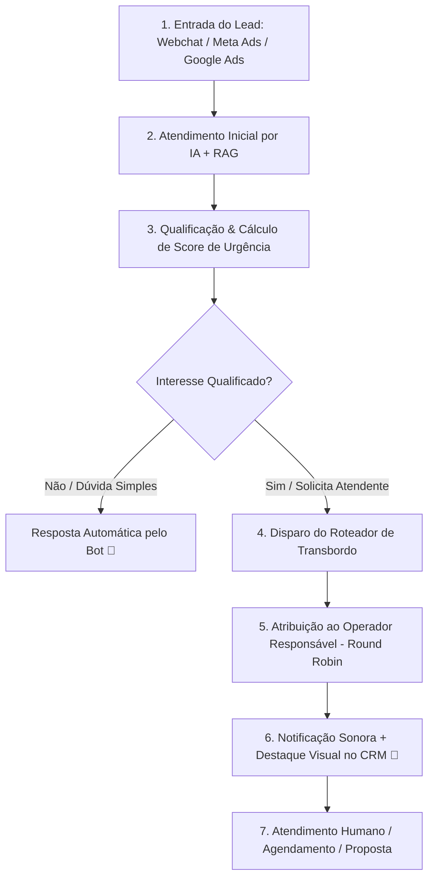

# 23 Gestão de CRM, Fila de Leads e Webchat

> **Manual do Usuário — Guia Ilustrado de Operação do CRM Kanban, Fila de Leads, Webchat Público e Transbordo**

---

## 1. Fluxo de Vida do Lead no CRM

O gerenciamento de oportunidades segue um fluxo automatizado que une Inteligência Artificial e atendimento humano:



---

## 2. Interface Visual do Quadro Kanban (`/admin/crm/kanban`)

Abaixo encontra-se a representação do quadro Kanban de atendimento a leads:

```
+---------------------------------------------------------------------------------------------------------+
|  💬 QUADRO KANBAN DE LEADS      [Filtro Período: 30 Dias v]   [Origem: Todas v]   [+ Criar Lead Manual] |
+---------------------------------------------------------------------------------------------------------+
|  NOVO LEAD (4)      | EM QUALIFICAÇÃO (3) | VISITA AGENDADA (2) | PROPOSTA (1)      | GANHO (12)        |
+---------------------+---------------------+---------------------+-------------------+-------------------+
| [🔴 SCORE 95 - HOT] | [🟡 SCORE 65 - WARM]| [🔴 SCORE 98 - HOT] | [🔴 SCORE 92 - HOT]| [🟢 CONCLUÍDO]    |
| João Carlos Silva   | Ana Paula Oliveira  | Carlos Eduardo      | Mariana Rios      | Roberto Mendonça  |
| Interesse: Apt 3Q   | Interesse: Casa     | Imóvel #145         | Proposta: R$ 720k | Compra Concluída  |
| Há 5 minutos ⏱️     | Há 12 minutos ⏱️    | Visita: Amanhã 15h  | Ag: Paulo Silva   | Comissão: R$ 36k  |
| 👤 Paulo Silva      | 👤 Sem Dono         | 👤 Paulo Silva      | 👤 Paulo Silva    | 👤 Ana Lima       |
| [📞 Ligar] [💬 Chat]| [📞 Ligar] [💬 Chat]| [📞 Ligar] [💬 Chat]| [📞 Ligar] [💬 Chat]| [📄 Ver Contrato] |
+---------------------+---------------------+---------------------+-------------------+-------------------+
```

---

## 3. Interpretação dos Elementos dos Cards de Leads

Cada card no Kanban fornece informações resumidas e acionáveis sobre a oportunidade:

1. **Badge de Score / Urgência**:
   * 🔴 **Score 80 a 100 (Quente / HOT)**: Lead com alta intenção de compra imediata ou orçamento aprovado.
   * 🟡 **Score 50 a 79 (Morno / WARM)**: Lead em fase de pesquisa de mercado.
   * 🔵 **Score 0 a 49 (Frio / COLD)**: Lead em prospecção futura.
2. **Badge de Origem**:
   * `[Meta Ads]` (Lead Ads do Instagram/Facebook), `[Google Ads]` (Busca do Google), `[Webchat]` (Chat do site público), `[Direto]` (Cadastro manual).
3. **Avatar do Responsável (`OwnerAvatar`)**:
   * Exibe a foto do corretor/operador responsável. Se o lead ainda não tiver atendente, exibirá `[👤 Sem Dono]`.
4. **Tempo de Espera ⏱️**:
   * Mostra há quanto tempo o lead aguarda interação humana.

---

## 4. Matriz de Filtros de Período do CRM

A barra superior do CRM conta com seletores flexíveis para análise temporal dos leads:

| Opção de Filtro | Intervalo de Datas Considerado | Finalidade de Uso |
| :--- | :--- | :--- |
| **7 Dias** | Últimos 7 dias a partir de hoje. | Foco na operação semanal e acompanhamento de leads recentes. |
| **30 Dias** | Últimos 30 dias corridos (Padrão). | Visão mensal do funil comercial e metas da equipe. |
| **90 Dias** | Últimos 3 meses. | Análise trimestral de conversão de leads lentos. |
| **Personalizado** | Seleção manual via `DateInputPtBR` (De / Até). | Auditoria de campanhas específicas ou eventos promocionais. |
| **Histórico Completo** | Todos os registros da base de dados. | Avaliação completa da carteira histórica de clientes. |

---

## 5. Tela de Atendimento ao Vivo e Transbordo de Atendimento

Ao clicar em **[💬 Chat]** no card do lead, a janela de atendimento em tempo real é aberta:

```
+---------------------------------------------------------------------------------------------------------+
|  💬 CHAT COM: João Carlos Silva (Lead #803)                  [👤 Atribuído: Paulo Silva] [Assumir Chat] |
+---------------------------------------------------------------------------------------------------------+
|  🤖 [BOT IA]: Olá João! Vi que você se interessou pelo Apartamento em Boa Viagem.                       |
|  👤 [JOÃO]: Sim! Gostaria de saber o valor do condomínio e agendar uma visita amanhã.                    |
|  🤖 [BOT IA]: O condomínio é R$ 850/mês. Vou chamar o corretor Paulo para confirmar o horário.          |
|  ------------------ 🔔 SISTEMA: TRANSBORDO EXECUTADO - CHAT TRANSFERIDO PARA PAULO -------------------  |
|  👨‍💼 [PAULO SILVA]: Olá João! Tudo bem? Posso confirmar sua visita para amanhã às 15h?                   |
+---------------------------------------------------------------------------------------------------------+
|  [ Digite sua mensagem aqui...                                                         ]  [ Enviar 🚀 ] |
+---------------------------------------------------------------------------------------------------------+
```

### Regras do Robô de Transbordo Automatizado:
1. Quando o bot solicita um atendente humano, o robô dispara a rotação *Round-Robin*.
2. O sistema seleciona o próximo corretor da lista que estiver com o status **🟢 Online**.
3. Se o corretor não responder em até **15 minutos**, o robô remove a atribuição e repassa o lead para o próximo profissional da fila, registrando a ocorrência nos logs do CRM.
