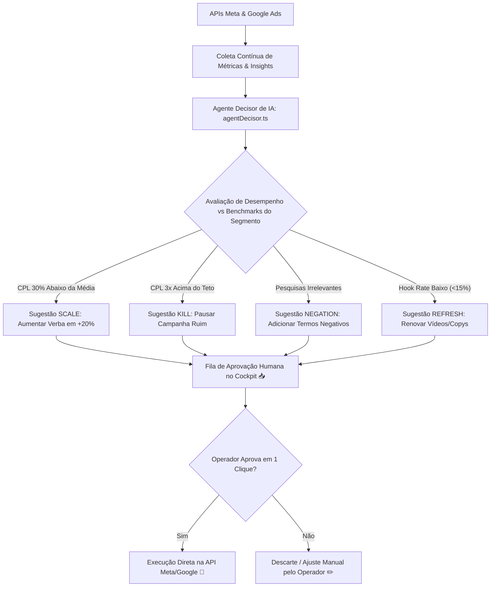

# 24 Pilotagem do Cockpit Ads (Meta & Google)

> **Manual do Usuário — Guia Ilustrado de Operação do Cockpit de Tráfego Pago, Farol de Saúde e Fila de Aprovação da IA**

---

## 1. Visão Geral do Cockpit de Tráfego Pago (`/admin/campanhas/dashboard`)

O Cockpit de Ads centraliza a inteligência e o controle das campanhas do **Meta Ads (Facebook/Instagram)** e **Google Ads (Pesquisa e Performance Max)** em uma interface dividida em 4 abas especializadas.

---

## 2. Diagrama do Loop de Decisão Automatizada do Agente de IA



---

## 3. As 4 Abas Principais do Cockpit

```
+---------------------------------------------------------------------------------------------------------+
| [🎯 COMMAND CENTER (Visão Executiva)]  [📊 ANÁLISE]  [🧠 INTELIGÊNCIA PROFUNDA]  [🔍 GOOGLE ADS]        |
+---------------------------------------------------------------------------------------------------------+
```

### Aba 1: Command Center (Visão Executiva)
Projetada para diretores e gestores que precisam de um diagnóstico rápido da operação de tráfego pago:

```
+---------------------------------------------------------------------------------------------------------+
|  📊 FAROL DE SAÚDE DAS CAMPANHAS                                  [Atualizado há 3 min 🔄]              |
|  +------------------------+------------------------+------------------------+------------------------+  |
|  | 🟢 CAMPANHAS SAUDÁVEIS | 🟡 REQUER ATENÇÃO      | 🔴 CRÍTICO / ALTO CPL  | 💰 GASTO TOTAL (MÊS)   |  |
|  | 8 Campanhas (CPL R$14) | 2 Campanhas            | 1 Campanha (CPL R$68)  | R$ 24.500,00           |  |
|  +------------------------+------------------------+------------------------+------------------------+  |
|                                                                                                         |
|  🤖 FILA DE RECOMENDAÇÕES DA INTELIGÊNCIA ARTIFICIAL (3 Pendentes)                                      |
|  +---------------------------------------------------------------------------------------------------+  |
|  | 🚀 SCALE | Campanha 'Imóveis Lançamento Centro': CPL R$ 12,00 (45% abaixo do teto).                 |  |
|  | Sugestão: Aumentar orçamento de R$ 100/dia para R$ 120/dia.                                       |  |
|  | [ ❌ Rejeitar ]                                                  [ 🟢 APROVAR E APLICAR AGORA ]   |  |
|  +---------------------------------------------------------------------------------------------------+  |
|  | 🛑 KILL  | Campanha 'Casas Antigas Venda': Gastou R$ 450,00 sem nenhum lead qualificado.             |  |
|  | Sugestão: Pausar anúncio imediatamente para estancar prejuízo.                                    |  |
|  | [ ❌ Rejeitar ]                                                  [ 🛑 APROVAR PAUSA AGORA ]       |  |
|  +---------------------------------------------------------------------------------------------------+  |
```

### Aba 2: Análise e Comparativo Multi-Rede
Exibe tabelas comparativas detalhadas entre as plataformas de mídia:

| Rede Social / Canal | Investimento (R$) | Leads Gerados | CPL Médio (R$) | CTR (%) | ROAS Estimado |
| :--- | :--- | :--- | :--- | :--- | :--- |
| **Meta Ads (Instagram/FB)** | R$ 14.200,00 | 710 Leads | R$ 20,00 | 2.85% | 4.8x |
| **Google Ads (Search/PMax)**| R$ 10.300,00 | 412 Leads | R$ 25,00 | 4.12% | 5.2x |
| **Totais Consolidados** | **R$ 24.500,00** | **1.122 Leads** | **R$ 21,83** | **3.48%** | **4.96x** |

### Aba 3: Inteligência Profunda & Análise de Criativos
* **Hook Rate (Taxa de Retenção nos 3s)**: Avalia o desempenho dos primeiros 3 segundos de vídeos no Instagram/TikTok.
* **Fadiga de Criativos**: Identifica quando a frequência de exibição de um anúncio passa de 4.0x e o público para de clicar.

### Aba 4: Google Ads (Search Terms & Negativações)
Tabela dedicada a palavras-chave pesquisadas pelos usuários no Google:

```
+---------------------------------------------------------------------------------------------------------+
| 🔍 TERMOS DE PESQUISA RECENTES DO GOOGLE ADS                                                            |
| +--------------------------------+---------------+---------------+-----------------------------------+  |
| | Termo Pesquisado pelo Usuário  | Cliques       | Custo Total   | Ação Recomendada pela IA          |  |
| +--------------------------------+---------------+---------------+-----------------------------------+  |
| | "apartamento 3 quartos centro" | 45 Cliques    | R$ 112,50     | 🟢 Manter (Gerou 4 Leads)         |  |
| | "curso de corretor gratis"     | 18 Cliques    | R$ 54,00      | 🔴 NEGATIVAR (Irrelevante)        |  |
| | "emprego na imobiliaria"       | 12 Cliques    | R$ 36,00      | 🔴 NEGATIVAR (Irrelevante)        |  |
| +--------------------------------+---------------+---------------+-----------------------------------+  |
| [ ➕ NEGATIVAR TERMOS SELECIONADOS EM 1 CLIQUE ]                                                       |  |
+---------------------------------------------------------------------------------------------------------+
```

---

## 4. Guia de Aprovação de Ações da IA em 1 Clique

Quando a IA sugere uma otimização na Fila de Aprovação, você deve agir da seguinte forma:

1. **Ação `SCALE` (Aumentar Orçamento)**:
   * **O que a IA fez**: Identificou que o anúncio está performando muito acima da média.
   * **Como agir**: Clique no botão verde **[🟢 APROVAR E APLICAR AGORA]**. O sistema fará a chamada de API na rede Meta/Google e aumentará a verba imediatamente.
2. **Ação `KILL` (Pausar Anúncio)**:
   * **O que a IA fez**: Detectou que o anúncio está queimando orçamento.
   * **Como agir**: Clique no botão vermelho **[🛑 APROVAR PAUSA AGORA]** para suspender o anúncio na hora.
3. **Ação `NEGATION` (Negativação de Palavras)**:
   * **O que a IA fez**: Encontrou pesquisas que trazem tráfego desqualificado.
   * **Como agir**: Clique em **[➕ APROVAR NEGATIVAÇÃO]** para inserir as palavras na lista de bloqueio do Google Ads.
