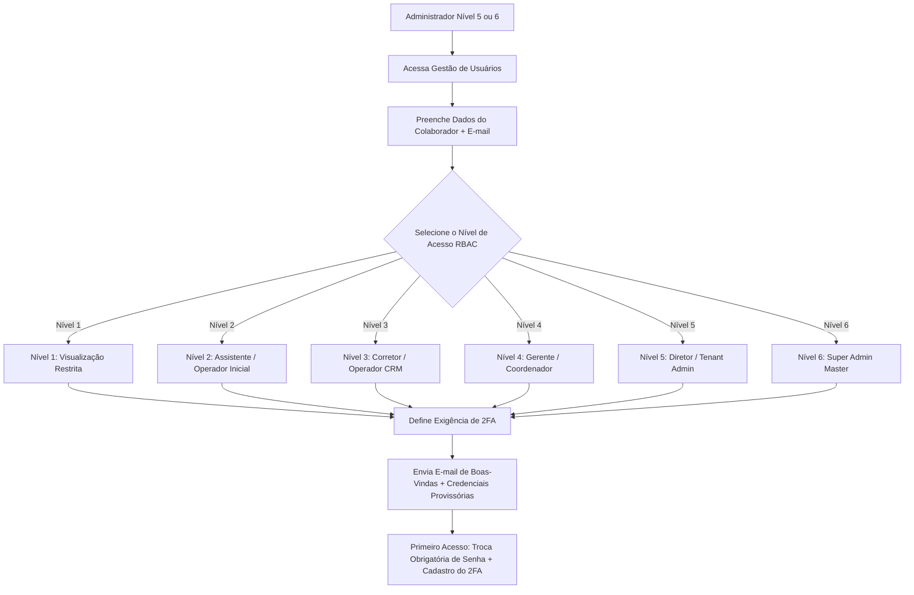

# 25 Gestão de Usuários, Permissões e 2FA

> **Manual do Usuário — Guia Ilustrado de Gestão de Colaboradores, Matriz RBAC (Níveis 1 a 6) e Segurança 2FA**

---

## 1. Fluxo de Provisionamento de Usuário e Segurança

O cadastro e gerenciamento de acessos de novos colaboradores segue um protocolo de segurança rigoroso:



---

## 2. Interface Visual da Gestão de Usuários (`/admin/seguranca/usuarios`)

Abaixo está o esquema visual da tela de administração de colaboradores:

```
+---------------------------------------------------------------------------------------------------------+
| 🔐 GESTÃO DE USUÁRIOS E PERMISSÕES                                          [+ CADASTRA NOVO USUÁRIO]   |
+---------------------------------------------------------------------------------------------------------+
| [Buscar por Nome/E-mail... 🔍]  [Filtro Nível: Todos v]  [Filtro 2FA: Todos v]                          |
+---------------------------------------------------------------------------------------------------------+
| Nome do Colaborador  | E-mail de Acesso           | Nível de Acesso RBAC | Status 2FA | Ações          |
+----------------------+----------------------------+----------------------+------------+----------------+
| Paulo Silva          | paulo.silva@imovtec.com.br  | 👑 Nível 5 (Diretor) | 🟢 ATIVO   | [Editar] [🔑] |
| Ana Paula Oliveira   | ana.paula@imovtec.com.br   | 💼 Nível 4 (Gerente) | 🟢 ATIVO   | [Editar] [🔑] |
| Carlos Eduardo       | carlos.eduardo@imovtec.com | 👤 Nível 3 (Corretor)| 🟡 PENDENTE | [Editar] [🔑] |
| Mariana Rios         | mariana.rios@imovtec.com   | 👁️ Nível 1 (Leitura) | 🔴 INATIVO  | [Editar] [🔑] |
+---------------------------------------------------------------------------------------------------------+
| [🔑 Redefinir Chave 2FA do Usuário Selecionado]                     [ 🗑️ Bloquear / Desativar Usuário ]  |
+---------------------------------------------------------------------------------------------------------+
```

---

## 3. Matriz Completa de Permissões por Nível de Acesso (RBAC 1 a 6)

A tabela a seguir especifica as permissões exatas de cada nível sobre os módulos do sistema:

| Módulo / Funcionalidade | Nível 1 (Leitura) | Nível 2 (Assistente) | Nível 3 (Corretor) | Nível 4 (Gerente) | Nível 5 (Diretor) | Nível 6 (Super Admin) |
| :--- | :---: | :---: | :---: | :---: | :---: | :---: |
| **Visualizar Dashboard** | 👁️ Leitura | 👁️ Leitura | 👁️ Leitura | 🟢 Total | 🟢 Total | 🟢 Total |
| **Cadastrar Imóveis** | ❌ Não | ✏️ Rascunho | 🟢 Seus Imóveis | 🟢 Total | 🟢 Total | 🟢 Total |
| **Publicar Imóvel (Status 99 ➔ Ativo)** | ❌ Não | ❌ Não | ❌ Não | 🟢 Total | 🟢 Total | 🟢 Total |
| **Atender Leads no CRM** | ❌ Não | 👁️ Acompanhar | 🟢 Seus Leads | 🟢 Toda Equipe | 🟢 Total | 🟢 Total |
| **Aprovar Ações de Ads (SCALE/KILL)** | ❌ Não | ❌ Não | ❌ Não | 🟢 Total | 🟢 Total | 🟢 Total |
| **Cadastrar Novos Colaboradores** | ❌ Não | ❌ Não | ❌ Não | ❌ Não | 🟢 Níveis 1 a 5 | 🟢 Níveis 1 a 6 |
| **Resetar Chave 2FA de Outro Usuário**| ❌ Não | ❌ Não | ❌ Não | ❌ Não | 🟢 Total | 🟢 Total |
| **Acessar Logs de Auditoria (`SystemLog`)**| ❌ Não | ❌ Não | ❌ Não | 👁️ Leitura | 🟢 Total | 🟢 Total |

---

## 4. Instruções Passo a Passo para Reset de Chave 2FA

Se um colaborador trocar ou perder o celular e não conseguir gerar o token do 2FA TOTP:

1. Na lista de usuários, localize a linha do colaborador.
2. Clique no ícone de chave **[🔑 Resetar 2FA]**.
3. Confirme a ação na caixa de diálogo de segurança.
4. O sistema irá:
   * Limpar o secret TOTP e revogar os tokens de sessão ativos daquele usuário.
   * Alterar o status do 2FA do colaborador para `🟡 PENDENTE`.
   * No próximo login, o colaborador será direcionado para a tela de escaneamento de um **novo QR Code**.
