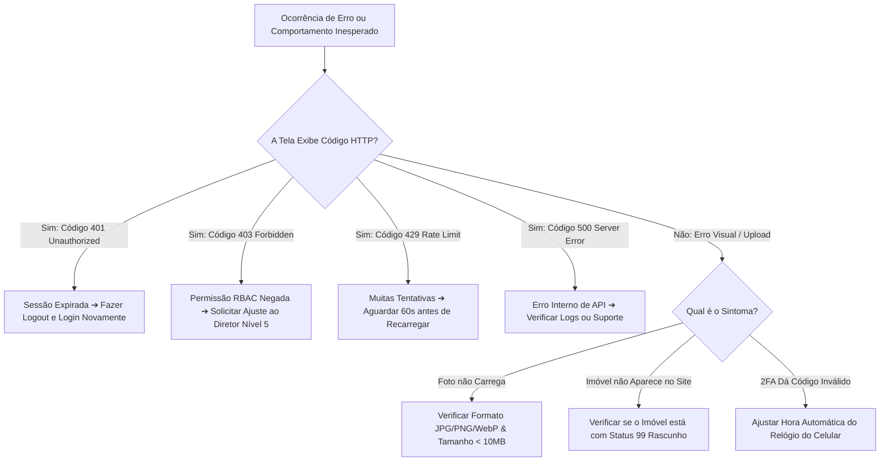

# 26 Solução de Problemas e FAQ

> **Manual do Usuário — Guia Ilustrado de Diagnóstico de Erros, Resolução de Falhas e FAQ**

---

## 1. Fluxograma de Resolução de Problemas no Sistema

Quando você encontrar qualquer comportamento inesperado ou mensagem de erro na aplicação, siga este procedimento padronizado:

---

## 2. Tabela Ilustrada de Diagnósticos de Erros da Aplicação

Abaixo encontra-se a matriz completa de mensagens de erro, causas prováveis e ações imediatas:

| Badge do Erro | Código HTTP | Causa Provável | Solução Passo a Passo |
| :--- | :---: | :--- | :--- |
| `[🔴 401 UNAUTHORIZED]` | **401** | O token JWT de sessão expirou ou o 2FA foi desativado por um administrador. | 1. Clique no botão de Logout. 2. Limpe os cookies do navegador (`F12` ➔ *Application* ➔ *Clear Site Data*). 3. Faça login novamente. |
| `[🟡 403 FORBIDDEN]` | **403** | Seu Nível de Acesso (RBAC 1 a 6) não possui permissão para executar esta ação. | 1. Identifique a rota acessada (ex: `/admin/campanhas/dashboard`). 2. Entre em contato com seu gestor (Nível 5) para conceder o papel correto. |
| `[🔵 429 TOO MANY REQUESTS]`| **429** | O robô de segurança ativou a proteção antibot por muitas chamadas seguidas. | 1. Aguarde 60 segundos sem clicar. 2. Atualize a página (`F5`). |
| `[🔴 500 INTERNAL ERROR]` | **500** | Falha de comunicação entre o backend Next.js e o PostgreSQL / Redis. | 1. Verifique se o serviço de banco de dados está online. 2. Verifique os logs do container via `docker compose logs web`. |
| `[⚠️ UPLOAD_LIMIT_EXCEEDED]`| **400** | Imagem enviada possui mais de 10MB ou extensão não permitida. | 1. Redimensione a foto ou converta para formato WebP/JPG. 2. Reenvie a imagem. |
| `[⚠️ INVALID_TOTP_CODE]` | **400** | Desincronização de relógio entre o celular do usuário e o servidor VPS. | 1. No celular, vá em *Configurações* ➔ *Data e Hora*. 2. Marque a opção **Data e Hora Automáticas**. |

---

## 3. Perguntas Frequentes (FAQ Ilustrado)

### ❓ Esqueci minha senha e perdi acesso ao e-mail. Como proceder?
Peça ao Administrador Nível 5 ou 6 da sua empresa para acessar a tela **Segurança** ➔ **Usuários**, selecionar seu cadastro e clicar em **Redefinir Senha**. Ele gerará uma senha provisória para você.

### ❓ Cadastrei um imóvel, mas ele não aparece na busca do site público nem nos portais ZAP/OLX.
1. Abra a ficha do imóvel no painel.
2. Observe o badge no canto superior direito: se estiver marcando **`[🟡 STATUS 99 (RASCUNHO)]`**, o imóvel fica visível apenas para você.
3. Mude a chave para **`[🟢 STATUS ATIVO]`** e salve. O imóvel será publicado imediatamente no site e enviado na próxima carga de exportação.

### ❓ O robô de transbordo do CRM parou de me enviar novos leads. O que verificar?
1. Verifique se o seu status no topo da página está marcado como **`[🟢 Online]`**.
2. Verifique se o seu Nível de Acesso (Nível 3 ou superior) está vinculado à carteira ou região onde os leads estão sendo gerados.
