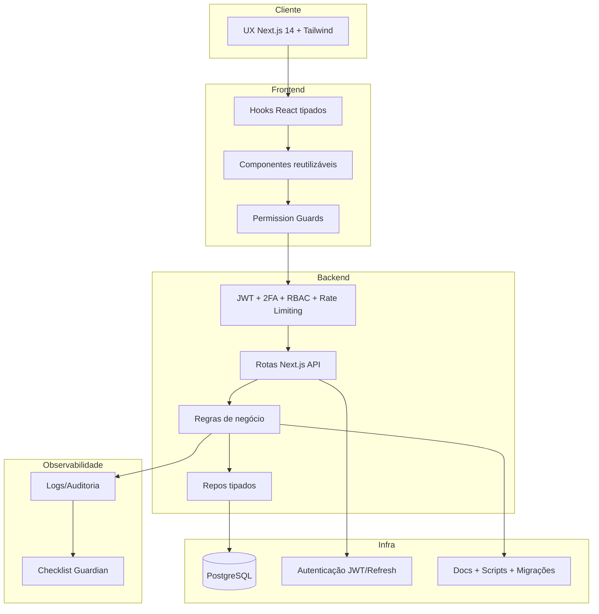
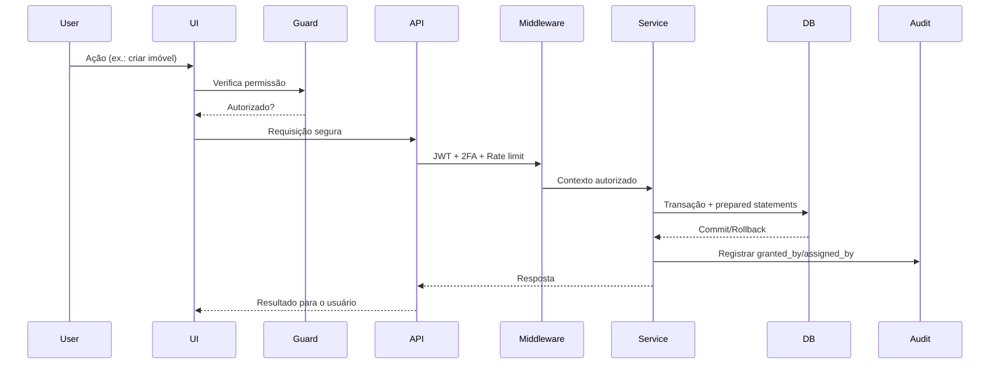
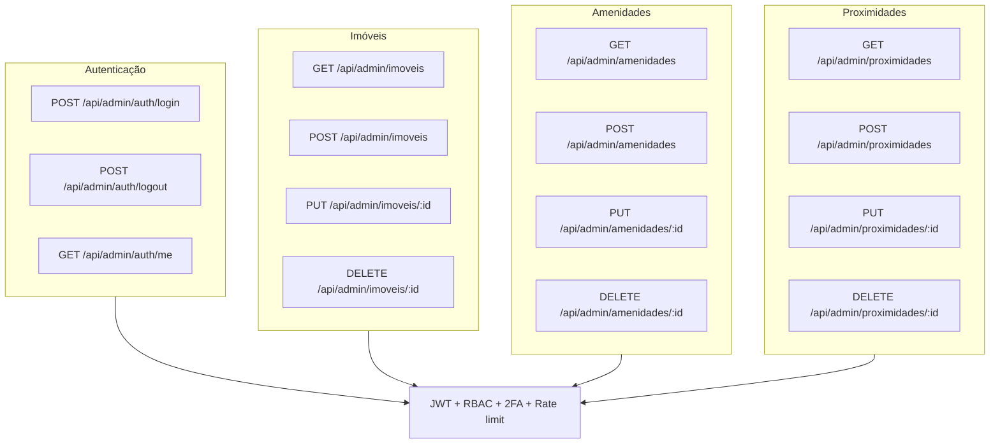
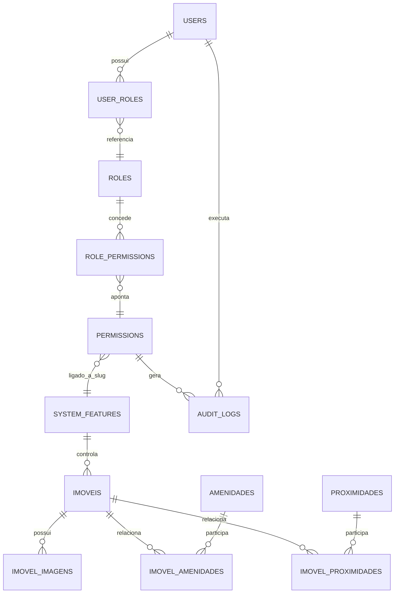
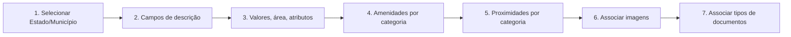

# ARQUITETURA GUARDIAN OVERVIEW

**Data:** 14/11/25  
**Fontes principais:** [`README.md`](../README.md) | [`GUARDIAN_RULES.md`](../GUARDIAN_RULES.md)

## Obrigações Invioláveis

- Análise holística + inventário: toda alteração exige `ANALISE_IMPACTO_[NOME].md` e consulta/atualização do inventário antes de qualquer linha de código.  
- Autorização explícita: identificou risco cruzado (tabelas/APIs/lógica/permissões)? interrompa, documente riscos/plano de rollback/etapas e aguarde liberação.  
- Incremental sempre: “INCREMENTAL SIM, DESTRUTIVO NUNCA”; demandas novas não podem degradar nem refazer funcionalidades existentes.  
- Proibição total de hardcoding: recursos sempre identificados via `system_features.slug` e mapeados por guards específicos, sem IDs fixos ou atalhos fora do padrão.

## Arquitetura Geral



## Fluxo Operacional e Middleware

```mermaid
flowchart LR
    UI[UI/UX] --> Validacao[Validação + Sequência CRUD obrigatória]
    Validacao --> Guards[Guards granulares]
    Guards --> API[/api/admin/*]
    API --> Middleware[JWT + 2FA + Rate limit + RBAC]
    Middleware --> Services[Serviços + transações]
    Services --> DB[(PostgreSQL)]
    Services --> Auditoria[(granted_by, reason, logs)]
    Auditoria --> Monitoramento[Revisão Guardian]
```



## Estrutura de Pastas

```mermaid
graph TD
    root[net-imobiliaria/]
    root --> src
    src --> app
    app --> admin
    app --> api
    app --> login
    app --> withHeader[(with-header)]
    src --> components
    components --> adminComp[admin/]
    src --> hooks
    src --> lib
    lib --> auth
    lib --> database
    lib --> middleware
    src --> types
    root --> databaseDir[database/ (schema, seeds, fixes)]
    root --> docsDir[docs/ (Guardian, análises, planos)]
    root --> scriptsDir[scripts/ e *.ps1/*.sh]
    root --> publicDir[public/ assets]
```

## APIs Administrativas



## Modelo de Dados e Relacionamentos



## Sequência UX Obrigatória (CRUD de Imóveis)



## Checklist Guardian (resumo)

- [ ] Identificar funcionalidades impactadas e atualizar inventário de dependências.  
- [ ] Produzir análise de impacto com riscos, mitigação e plano de rollback testável.  
- [ ] Validar segurança (RBAC, 2FA, rate limiting, prepared statements) em todas as camadas.  
- [ ] Garantir integridade do banco (transações, `granted_by`, FKs com cascata adequada).  
- [ ] Aplicar `PermissionGuard` e padrões de UX/Design responsivo.  
- [ ] Tipar o código (sem `any`/`@ts-ignore` injustificado) e evitar duplicações.  
- [ ] Registrar auditoria completa e justificar permissões temporárias.  
- [ ] Executar testes (regressão, integração, segurança, responsividade, perfis).  
- [ ] Documentar resultados e obter autorização antes de qualquer deploy.

## Templates Obrigatórios

- **Análise de Impacto:** seguir exatamente o bloco definido em [`GUARDIAN_RULES.md`](../GUARDIAN_RULES.md#2-template-de-análise-de-impacto), preenchendo objetivo, impactos por camada, riscos, rollback e cronograma.  
- **Relatório de Implementação:** usar o template oficial (status, testes, métricas, próximos passos e segurança).  
- **Referências adicionais:** documentos específicos em `docs/` (planos de migração, análises de risco, checklists complementares).

## Protocolo de Emergência

1. Parar imediatamente a implementação ao detectar quebra.  
2. Reverter para estado estável e comunicar o usuário.  
3. Identificar causa raiz, documentar lições aprendidas e revisar processo.  
4. Atualizar as Guardian Rules se necessário e aguardar nova autorização antes de retentar.  
5. Checklist de emergência: reversão, notificação, causa raiz, documentação, processo revisto e nova tentativa aprovada.

---

**Observação:** Todo conteúdo aqui sintetiza o desenho atual da solução e reforça que qualquer alteração deve obedecer integralmente às Guardian Rules e aos fluxos descritos.

