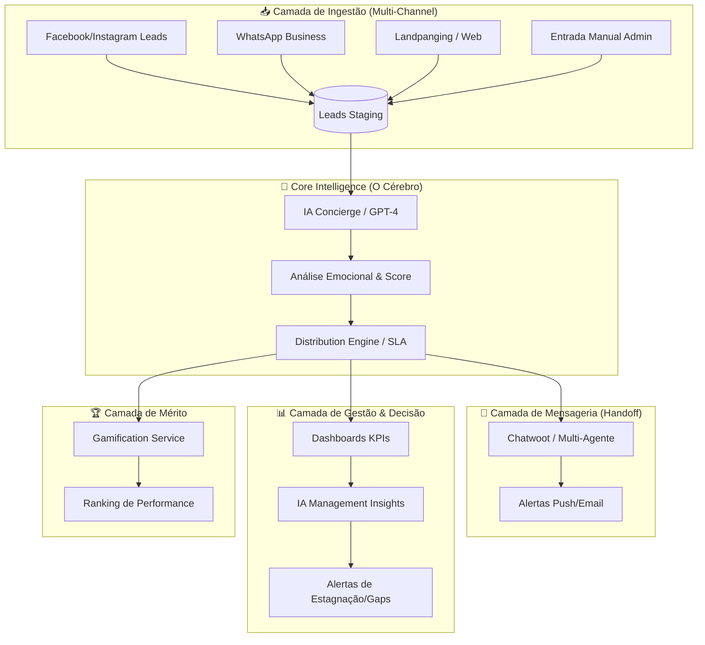

# 🌐 Arquitetura Holística & Filosofia Harness - CRM Intelligence

## 1. Visão High-Level de Arquitetura (Macro-Componentes)

O ecossistema **Net Imobiliária Intelligence** é composto por 5 camadas macro-funcionais que operam de forma orquestrada, porém independente.

### 🧩 Diagrama de Macro-Arquitetura

### Detalhamento dos Componentes:
- **CRM Core (Staging + IA):** Centraliza o recebimento de leads brutos. A IA qualifica (Tag do Sonho), atribui score de prontidão e prepara o "contexto emocional".
- **Mensageria (Chatwoot):** Desacopla o diálogo da gestão. O Chatwoot gerencia a conversa humana/bot, enquanto o CRM gerencia o ativo (lead) e o processo (pipeline).
- **Distribution Engine:** O coração operacional. Gerencia Round Robin, SLAs de 5 minutos e transbordo automático para garantir 0% de perda.
- **Management Insights:** Não apenas gráficos, mas IA analisando tendências (ex: "Aumento de 20% em leads de investimento no bairro X; recomendo mover corretores especialistas para essa área").

---

## 2. Desacoplamento Estratégico (Agnóstico & Plugável)

Para garantir a longevidade, o CRM opera sob o princípio de **Inversão de Dependência**.

- **Agnoticismo de Origem:** O `DistributionEngine` e o `ConciergeService` não sabem o que é "Landpaging". Eles recebem um objeto `StandardLead` via API. Se amanhã integrarmos um novo portal (ex: ZAP Imóveis), basta um adapter na Camada de Ingestão.
- **Independência do Admin:** O módulo Admin é apenas um consumidor das APIs de Staging e Kanban. A lógica de negócio reside exclusivamente nos Services do CRM.
- **Handoff de Mensageria:** A integração com Chatwoot ocorre via Webhooks. O CRM envia o contexto para o Chatwoot e recebe de volta os logs de interação, sem que um dependa do "binário" do outro.

---

## 3. Governança de Documentação & Guardian Rules

Toda a inteligência gerada deve ser refletida nas **Guardian Rules** para evitar a "erosão arquitetural".

1.  **Guardian Rules v3 (CRM Ready):**
    -   **Regra de Invariância de SLA:** Nenhuma alteração pode desativar o worker de transbordo sem uma análise de impacto aprovada.
    -   **Regra de Privacidade IA:** Dados sensíveis (GDPR/LGPD) devem ser anonimizados antes do envio para APIs de LLM externas.
2.  **Documentação Dinâmica:**
    -   `SPEC_CRM_INTELLIGENCE.md`: Define os contratos de interface IA <-> CRM.
    -   `SECURITY_PLAN_CRM.md`: Protocolos de criptografia e auditoria de acesso aos leads.
    -   `PERFORMANCE_SLA_REPORT.md`: Baseline de tempos de resposta e carga suportada.

---

## 4. Filosofia Harness (O Domínio do Fluxo)

A **Filosofia Harness** (Arreio/Arreamento) foca em domar a complexidade através da automação, observabilidade e segurança extrema.

### Os 4 Pilares Harness na Net Imobiliária:
1.  **Observabilidade Total:** "Se não é medido, não existe". Todo lead deve ter um rastro completo (da UTM original ao tempo de aceite no milissegundo).
2.  **Continuous Testing (Harness Testing):** Implementação de testes de carga no motor de distribuição. Simular 1000 leads/minuto e verificar se o Round Robin e o cache do PostgreSQL sustentam a carga.
3.  **Segurança por Design:** O harness protege o dado. Validação de UUIDs em todas as camadas e sanitização agressiva via middlewares.
4.  **Feedback-Loop Constante:** O Dashboard não é para consulta passiva; ele retroalimenta o sistema (ex: Corretores com baixo score de aceite perdem prioridade no arreio automático de novos leads).

---

## 🚀 Próximos Passos de Implantação:
- [ ] Criar o Master Spec de Integração Chatwoot.
- [ ] Implementar o `Security Middleware` para Staging APIs.
- [ ] Configurar os `Management Alerts` baseados em janelas de estagnação.
- [ ] Realizar o "Stress Test" do motor de transbordo.
