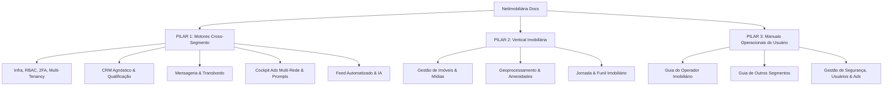

# NetImobiliária — Documentação Viva & Manual Operacional

> **Bem-vindo à Documentação Oficial da Plataforma NetImobiliária.**  
> Este portal reúne a especificação arquitetural completa, o funcionamento dos motores cross-segmento (agnósticos), as regras de negócio da vertical imobiliária e o manual prático para pilotagem e operação da aplicação.

---

## 📌 Estrutura da Documentação

A documentação está dividida em **3 Grandes Pilares de Navegação** (disponíveis na barra lateral à esquerda):



---

## 🎯 Pilares da Plataforma

### 1. Pilar Cross-Segmento (Horizontal / Agnóstico)
Projetado sob o princípio **Segmento ≠ Tenant**. A plataforma roda um motor genérico e configurável de CRM, Inteligência de Leads, Mensageria Webchat, Tráfego Pago (Meta e Google Ads) e Ingestão de Conteúdo (Feeds), capaz de atender tanto a **imobiliárias** quanto a **clínicas médicas, cursos, prestadores de serviços, varejo e automóveis**.

### 2. Pilar Vertical Imobiliário (Especializado)
Contém toda a especialização técnica para o setor imobiliário: cadastro completo de imóveis (venda, aluguel, lançamento), carteira de proprietários, fotos e vídeos ordenados, busca por proximidades/geolocalização e integração com portais.

### 3. Pilar Manuais Operacionais do Usuário
Guias passo a passo voltados aos **operadores e administradores**, explicando como pilotar cada tela, gerenciar equipe com permissões hierárquicas (Níveis 1 a 6), ativar 2FA, aprovar copys do gerador de feed e otimizar campanhas de tráfego pago.

---

## 🚀 Como Executar a Documentação Localmente

Para abrir a documentação interativa com busca em tempo real e visualização de diagramas no seu navegador:

```bash
npm run docs
```

A documentação estará acessível em `http://localhost:3012`.
Alternativamente, acesse a rota `/admin/documentacao` no painel web para consultar o manual diretamente na aplicação.
